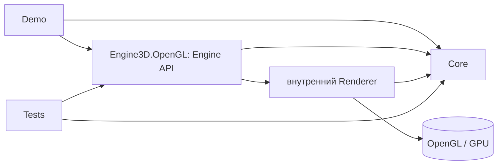
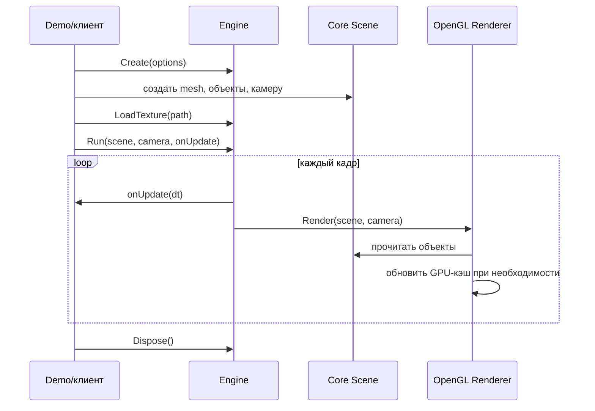

# Архитектура 3D-графического движка

**Статус:** базовый контракт v1 описан по результатам spike #5 на 07.10.2026; нормали/свет и JSON сохранены по PR #26. Создан solution net10.0, реализованы CPU-модели Core (#7), примитивы (#8) и базовый OpenGL-рендер `Engine` со светом (#9); текстуры, JSON и Demo еще предстоят. Описание фиксирует границы и ответственность модулей. Точные сигнатуры и ошибки — в [API v1](api.md). OpenTK lifecycle и передача матриц проверены spike; новые нормали/свет/JSON проверяются при реализации согласно [API](api.md).

**Основание:** [требования P0-01…P0-11](requirements.md) и [основной план](../project_plan.md).

## 1. Архитектурное решение

Проект состоит из **двух библиотек, демо-приложения и тестового проекта**:

| Сборка | Зависит от | Что содержит |
|---|---|---|
| `Engine3D.Core` | стандартная библиотека .NET | Сцена, объекты, камера, данные сетки и текстуры, материал, трансформации, фабрика куба/плоскости с нормалями, параметры света, JSON-сериализатор с внутренними DTO, проверки входных данных. Не создает окно и не обращается к OpenGL. |
| `Engine3D.OpenGL` | `Engine3D.Core`, OpenTK, выбранный декодер изображения | Публичный `Engine`, окно/контекст, цикл событий, OpenGL-рендерер, загрузка изображения с SourcePath, базовый lit-шейдер, GPU-кэш и освобождение GPU-ресурсов. |
| `Engine3D.Demo` | публичные типы двух библиотек | Сцены показа и нагрузки, изменение камеры/transform/света, вызов Save/Load и передача textureLoader, запись условий FPS-замера. Прямые вызовы OpenGL исключены. |
| `Engine3D.Tests` | `Core`, `OpenGL` (публичный API; внутренние счетчик GPU-кэша и снимок кадра — через InternalsVisibleTo) | Числовые тесты без окна; графические тесты `Engine` только при `ENGINE3D_GRAPHICS_TESTS=1`. |

Не добавлять отдельные сборки `Application`, `Infrastructure`, `Resources`, `Shaders` и т. п., пока реальная связность/объем кода не потребуют разделения. Единственный рендерер — OpenGL; интерфейс сменяемого graphics backend в P0 не нужен.

Внешняя программа видит `Engine`, `Scene`, `Camera`, `SceneObject`, `MeshData`, `MaterialData`, `TextureData`, `SceneLighting`, `SceneSerializer`, `SceneSnapshot`. Она не видит VAO/VBO/EBO, OpenGL-идентификаторы, шейдерные программы и внутренний кэш.

## 2. Модель данных

| Тип | Содержит | Связь и владение |
|---|---|---|
| `Vertex` | Позиция `Vector3`, UV `Vector2`, локальная нормаль `Vector3` | Неизменяемое значение; MeshData валидирует и нормализует нормаль. |
| `MeshData` | Неизменяемые вершины и индексы треугольников; внутреннее описание примитива при создании фабрикой | CPU-данные; собственные копии вершин/индексов, публичный доступ через ReadOnlySpan. Один экземпляр может использоваться многими `SceneObject`. |
| `TextureData` | Неизменяемые RGBA8-пиксели, ширина, высота, необязательный полный SourcePath | CPU-данные; собственная копия RGBA8 сверху вниз, публичный доступ Pixels через ReadOnlySpan. Могут использоваться несколькими материалами. |
| `MaterialData` | Базовый цвет и необязательная `TextureData` | Непрозрачный материал с базовым светом; PBR и пять слотов текстур не входят в P0. |
| `Transform` | Позиция, `Quaternion` вращения, масштаб | Принадлежит одному объекту; матрица вычисляется из текущих значений. |
| `SceneObject` | `MeshData`, `MaterialData`, `Transform` | Одна видимая инстанция геометрии; не содержит физику/игровое поведение. |
| `Scene` | Упорядоченная коллекция объектов и `SceneLighting` | Добавляет и удаляет инстанции; не владеет GPU-ресурсами. |
| `SceneLighting` | Фоновый RGB, RGB направленного света, направление лучей | CPU-данные Scene, изменяемые на потоке onUpdate; без Dispose. |
| `SceneSerializer` / `SceneSnapshot` | Save/Load и восстановленные Scene/Camera | Core, новые CPU-объекты; textureLoader передает клиент, GPU не сохраняются. |
| `Camera` | Положение, точка взгляда, up, угол обзора, near/far | Дает видовую и проекционную матрицы; не зависит от окна. |

**Зафиксированные координатные соглашения для P0:** правая система координат; `Y` направлена вверх; камера по умолчанию смотрит вдоль `-Z`; единицы длины условные; индексная геометрия состоит из треугольников; `UV (0,0)` — нижний левый угол изображения в логике движка. Если декодер дает строки сверху вниз, преобразование выполняется в `OpenGL`-слое. По завершенному [spike](spikes.md) System.Numerics использует вектор-строку: model = scale * rotation * translation, MVP = model * view * projection. Core возвращает projection с NDC depth [0,1]; только OpenGL умножает ее справа на Identity с M33=2/M43=-1 для depth [-1,1]; в GLSL матрица читается транспонированной, UniformMatrix4 передает данные с transpose=false. Quaternion проверяется на конечность и ненулевую длину, нормализуется для расчета model matrix и Save/Load. World-нормаль вычисляется inverse-transpose линейной части model и нормализуется; в GLSL это transpose(inverse(mat3(u_model))), без translation/view. Инварианты и ошибки — [API, раздел 8](api.md#8-нормали-и-простой-свет-p0-10).

**Ограничения простоты:** одна камера на вызов `Run`, без parent/child-иерархии; непрозрачные объекты; один базовый материал на объект; без анимационной подсистемы. Приложение может менять `Transform` в каждом кадре через callback.

## 3. Жизненный цикл и API

Для P0 принимаем **одну точку входа**:

1. `Engine.Create(options)` создает окно и графический контекст либо сообщает об ошибке. Отдельного публичного `Initialize()` нет.
2. Приложение создает данные сцены и при необходимости вызывает `Engine.LoadTexture(path)` до запуска цикла.
3. `Engine.Run(scene, camera, onUpdate)` запускает цикл событий и кадров; `onUpdate(deltaSeconds)` выполняется в вызывающем приложении и может менять `Scene`/`Camera`.
4. Закрытие окна или `Engine.RequestClose()` завершает `Run`.
5. `Engine.Dispose()` освобождает GPU-буферы, текстуры, шейдеры и контекст. CPU-объекты сцены обычные управляемые данные.

Это **решение плана**, выбранное ради короткого API и совместимости с типичным циклом `GameWindow`. Завершенный spike 1.2 проверил этот путь на целевом стенде; его перенос в основной Engine еще предстоит. Если конкретный OpenTK lifecycle делает контракт неудобным, менять нужно эту страницу и [API](api.md) вместе до основной реализации, а не скрывать второй цикл событий внутри рендера.

## 4. Отрисовка и ресурсы

1. При первом использовании `MeshData`/`TextureData` рендерер создает GPU-представление и запоминает его **по идентичности исходного CPU-объекта**. Повторные `SceneObject` используют тот же GPU-ресурс. Изменение геометрии в P0 делается новым `MeshData`; изменение transform не требует новой загрузки mesh.
   Renderer читает Vertices/Indices/Pixels только на время upload. CPU RGBA8 переворачивается один раз при GPU upload, а не в LoadTexture.
2. В кадре: обработать события → вызвать `onUpdate` → проверить camera/light/material/все transform и построить обратимые матрицы после onUpdate до любых GL-вызовов → очистить цвет/depth и задать view/projection → обойти объекты сцены → для каждого задать model/normal matrix, базовый материал и параметры света → нарисовать индексные треугольники → показать кадр.
3. Depth test включен. Прозрачность и сортировка прозрачных полигонов исключены. Back-face culling можно оставить выключенным до проверки winding, чтобы не маскировать ошибки геометрии.
4. GPU-кэшем **владеет `Engine`**. `MeshData` и `TextureData` не реализуют `IDisposable`; пользователь освобождает один `Engine` через `using`. В P0 нет ручного раннего удаления отдельных GPU-ресурсов. Это делает жизненный цикл недвусмысленным, но долгоживущий `Engine` может удерживать ранее показанные ресурсы до конца сессии. Для учебного короткого демо риск приемлем; при реальном росте памяти добавить явное удаление после измерения.
5. Один `Engine` работает с одним OpenGL-контекстом и одним UI-потоком. Не обещать потокобезопасность `Scene` и загрузки ресурсов в P0. Повторный показ после закрытия — новый экземпляр `Engine`.

Минимальные шейдеры — внутренняя техническая часть OpenGL-рендера, а не публичная система программируемых материалов. Декодер изображения и его лицензия выбираются во время spike; для демо сначала использовать собственную контрольную PNG-текстуру.

## 5. Ошибки и инварианты

- `MeshData` принимает только непустой список вершин, индексы внутри диапазона и число индексов, кратное трем. Вырожденные треугольники допустимы для P0, если они не вызывают падения.
- `Camera` требует `NearPlane > 0`, `FarPlane > NearPlane` и разумный угол обзора между 0 и 180 градусами; нулевой размер окна отклоняется.
- Отсутствующий/нечитаемый/неподдерживаемый файл текстуры дает понятную ошибку загрузки. Программа не должна молча рисовать случайную память.
- Ошибка создания контекста прерывает `Engine.Create`; частично живой объект не возвращается.
- После `Dispose` любые попытки `Run` или `LoadTexture` отклоняются. Повторный `Dispose` безопасен.
- Исключение из `onUpdate` завершает цикл с освобождением внутренних ресурсов через `using` вызывающей стороны; оно не превращается в бесконечный цикл.

Точная иерархия исключений не нужна в P0. Публичный контракт должен документировать минимум тип/сообщение ошибки и не смешивать `TryLoad*` с исключениями без причины.

## 6. Производительность и точки измерения

Нагрузочный сценарий создает примерно 1000 `SceneObject`, но мало уникальных `MeshData`/`TextureData`. Это проверяет повторное использование ресурсов и стоимость множества отрисовок, а не импорт крупных моделей. Приложение записывает число объектов, треугольников, разрешение, VSync, CPU/GPU, период прогрева и период измерения. Счетчик **отрисованных** кадров доступен после `Run`; внешний `Stopwatch` дает средний FPS. Длительные просадки и время кадра фиксируются отдельно при возможности; не делать вид, что средний FPS описывает их полностью.

Если результат нагрузочного сценария неудовлетворителен, сначала измерить CPU-время обхода/вызовов draw и GPU-время, затем решать о группировке draw calls или instancing. Frustum culling и сложный кэш не добавлять до этих данных. Оптимизация не должна разрушать границу `Core`/`OpenGL` без измеренной причины.

## 7. Проверка требований архитектурой

| Требование | Где реализуется | Как наблюдать |
|---|---|---|
| P0-01 | `Engine` + `Demo` | Демо не содержит OpenGL-вызовов. |
| P0-02 | `Scene`, `SceneObject`, GPU-кэш | Два объекта и ~1000 инстансов используют общий mesh: внутренний счетчик GPU-мешей `Engine` равен числу разных `MeshData` (графический тест #9). |
| P0-03 | `MeshData`, `PrimitiveFactory` | Куб/плоскость и валидаторы геометрии. |
| P0-04 | `Transform`, `Camera`, матрицы | Изменение вида и ориентации в кадре. |
| P0-05 | `Renderer`, depth test | Ближний объект перекрывает дальний (пиксели кадра в графическом тесте #9). |
| P0-06 | `MaterialData`, `TextureData`, `LoadTexture` | Контрольная текстура на кубе. |
| P0-07 | `Demo` stress, счетчик кадров, `Renderer` | Протокол на целевом ноутбуке. |
| P0-08 | `Engine.Dispose`, `Tests`, smoke-сценарии | Повторные запуски и зеленые тесты. |
| P0-09 | Этот документ, [требования](requirements.md), [API](api.md) | Сценарии API проходят без доступа к внутренним классам. |
| P0-10 | Core Vertex/SceneLighting (#7/#8), OpenGL lit-шейдер (#9/#10) | Сценарий C: направление меняет яркость граней, UV/depth корректны. |
| P0-11 | Core SceneSerializer (#25), Demo C/D (#11), Tests/smoke (#12/#13) | JSON round-trip в новую сцену восстанавливает общий mesh и заданные данные. |

## 8. Что проверить до кодовой разработки модулей

**Spike 1.2 выполнен:** окно, куб, матрицы, depth, PNG и повторные запуски проверены; версии стенда и ограничения записаны в [отчете](spikes.md). Эксперимент не входит в Engine3D.sln; основной renderer реализуется #9 по принятому контракту.

**Статус контрактов #6 после завершенного spike:** нормали/свет и Save/Load/schema1 для #25 приняты через [PR #26](https://github.com/alken1t15/simple-3d-engine/pull/26), правила описаны в [API](api.md). В задаче #6 описаны базовые детали v1: ReadOnlySpan-доступ к CPU-данным, сигнатуры методов матриц/Engine, коррекция depth и правила ошибок/callbacks. Созданы четыре проекта net10.0 и build/test CI; принятие PR и реализация функций проверяются отдельно.

## 9. Граница сериализации и света

Свет вычисляется в world space: материал/текстура умножаются на ambient + directional diffuse. Направление — распространение лучей; dot берется с отрицанием нормализованного направления. Нормали, направления и изменяемые данные проверяются до GL; нулевой scale/необратимая матрица отклоняются. Отрицательный ненулевой scale сохраняется, baseline culling может быть выключен. Тени, PBR и дополнительные источники не добавляются. Точные сигнатуры и правила — [API](api.md#8-нормали-и-простой-свет-p0-10).

Core использует System.Text.Json и внутренний DTO version=1: уникальные описания cube/plane, объекты с meshId/transform/material, камера и свет. Фабрика сохраняет внутри MeshData описание происхождения; произвольный mesh рендерится, но не сохраняется этим минимальным форматом. Save группирует mesh по ReferenceEquals, Load создает один новый mesh на id; материалы на объект, текстуры — кеш по полному пути в рамках Load.

TextureData.SourcePath — неизменяемый абсолютный путь, Engine.LoadTexture задает его при декодировании. JSON содержит путь относительно каталога JSON; cwd не участвует в восстановлении. SceneSerializer не создает Engine: клиент передает делегат textureLoader. Без текстур Load не требует делегат, с текстурами валидирует его до создания результата. Save/Load выполняются вне Run, без одновременной записи сцены.

Load сначала полностью валидирует DTO, затем создает новую CPU-сцену; ошибка файла/данных/загрузчика не изменяет существующую сцену и не возвращает частичный результат. Побочные эффекты пользовательского делегата не откатываются. Save валидирует данные и строит JSON до записи; атомарный откат при I/O-отказе не обещается. В JSON нет GPU handles, пикселей, callbacks или состояния окна. Типы ошибок, schema1 и проверки C/D определены в [API, разделы 9–10](api.md#9-json-собственной-сцены-p0-11-25).

При интеграции #6 завершает базовые детали версии 1 API и scaffold/CI; контракты расширений уже приняты через PR #26, #7/#8 реализуют CPU-данные, #9/#10 — рендер/изображения, #25 — JSON. Solution и CI созданы; документы не означают готовность функций движка. Финальную нагрузку измерять с обязательным светом, после загрузки и прогрева.
