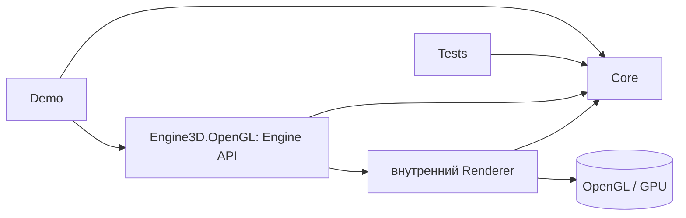
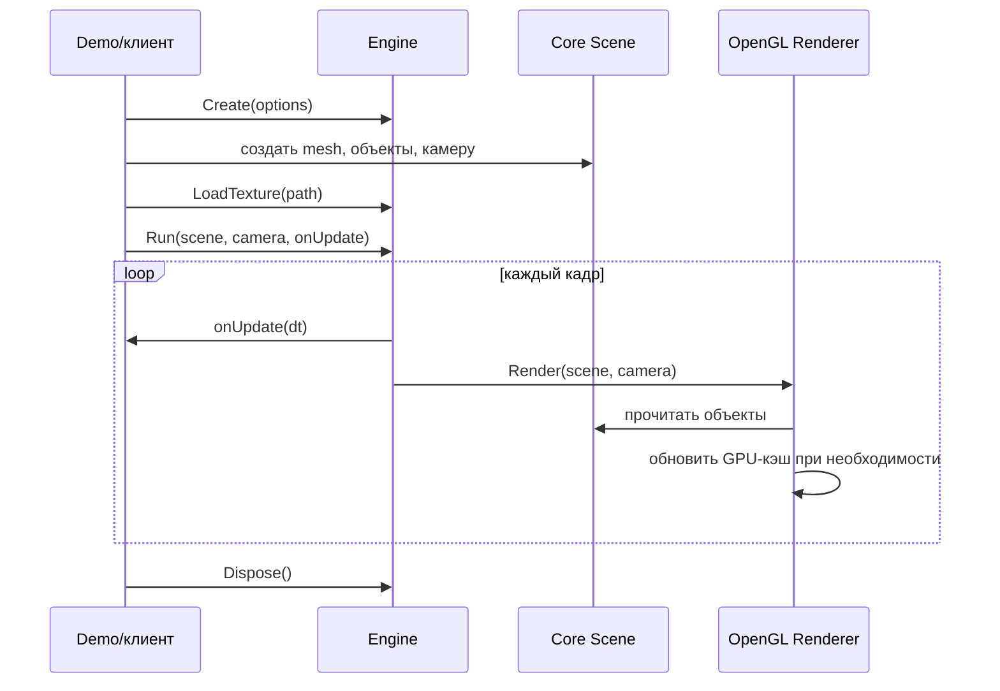

# Архитектура 3D-графического движка

**Статус:** проектное решение для P0, 27.09.2026. Описание фиксирует границы и ответственность модулей. Детали OpenTK и конвенцию передачи матриц на GPU проверить коротким spike до основной реализации.

**Основание:** [требования P0-01…P0-09](requirements.md), лекция преподавателя и [основной план](../project_plan.md). Схема на второй фотографии доски относится к учебному **векторному** примеру; здесь сохранен ее принцип разделения ядра, отрисовки и точки входа, а не ее буквальный набор модулей. Происхождение материалов — в [описании источников](sources.md).

## 1. Архитектурное решение

Проект состоит из **двух библиотек, демо-приложения и тестового проекта**:

| Сборка | Зависит от | Что содержит |
|---|---|---|
| `Engine3D.Core` | стандартная библиотека .NET | Сцена, объекты, камера, данные сетки и текстуры, материал, трансформации, фабрика куба/плоскости, проверки входных данных. Не создает окно и не обращается к OpenGL. |
| `Engine3D.OpenGL` | `Engine3D.Core`, OpenTK, выбранный декодер изображения | Публичный `Engine`, окно/контекст, цикл событий, OpenGL-рендерер, загрузка изображения, GPU-кэш и освобождение GPU-ресурсов. |
| `Engine3D.Demo` | публичные типы двух библиотек | Сцены показа и нагрузки, изменение камеры/transform, запись условий FPS-замера. Прямые вызовы OpenGL исключены. |
| `Engine3D.Tests` | `Core`, при необходимости публичная часть `OpenGL` | Числовые и интеграционные тесты без обязательного окна. |

Не добавлять отдельные сборки `Application`, `Infrastructure`, `Resources`, `Shaders` и т. п., пока реальная связность/объем кода не потребуют разделения. Единственный рендерер — OpenGL; интерфейс сменяемого graphics backend в P0 не нужен.

Внешняя программа видит `Engine`, `Scene`, `Camera`, `SceneObject`, `MeshData`, `MaterialData`, `TextureData`. Она не видит VAO/VBO/EBO, OpenGL-идентификаторы, шейдерные программы и внутренний кэш.

## 2. Модель данных

| Тип | Содержит | Связь и владение |
|---|---|---|
| `Vertex` | Позиция `Vector3` и UV `Vector2` | Значение; нормаль добавить только вместе с освещением P1. |
| `MeshData` | Неизменяемые вершины и индексы треугольников | CPU-данные; один экземпляр может использоваться многими `SceneObject`. |
| `TextureData` | Неизменяемые RGBA-пиксели, ширина, высота | CPU-данные; декодируются один раз, могут использоваться несколькими материалами. |
| `MaterialData` | Базовый цвет и необязательная `TextureData` | Непрозрачный unlit-материал; PBR и пять слотов текстур не входят в P0. |
| `Transform` | Позиция, `Quaternion` вращения, масштаб | Принадлежит одному объекту; матрица вычисляется из текущих значений. |
| `SceneObject` | `MeshData`, `MaterialData`, `Transform` | Одна видимая инстанция геометрии; не содержит физику/игровое поведение. |
| `Scene` | Упорядоченная коллекция объектов | Добавляет и удаляет инстанции; не владеет GPU-ресурсами. |
| `Camera` | Положение, точка взгляда, up, угол обзора, near/far | Дает видовую и проекционную матрицы; не зависит от окна. |

**Зафиксированные координатные соглашения для P0:** правая система координат; `Y` направлена вверх; камера по умолчанию смотрит вдоль `-Z`; единицы длины условные; индексная геометрия состоит из треугольников; `UV (0,0)` — нижний левый угол изображения в логике движка. Если декодер дает строки сверху вниз, преобразование выполняется в `OpenGL`-слое. Численный порядок умножения матриц и флаг транспонирования при загрузке uniform **не определять догадкой**: сверить по цветному контрольному кубу и тесту матриц в spike. До этой проверки команда не пишет параллельно камеры и шейдеры по разным конвенциям.

**Ограничения простоты:** одна камера на вызов `Run`, без parent/child-иерархии; непрозрачные объекты; один базовый материал на объект; без анимационной подсистемы. Приложение может менять `Transform` в каждом кадре через callback.

## 3. Жизненный цикл и API

Для P0 принимаем **одну точку входа**:

1. `Engine.Create(options)` создает окно и графический контекст либо сообщает об ошибке. Отдельного публичного `Initialize()` нет.
2. Приложение создает данные сцены и при необходимости вызывает `Engine.LoadTexture(path)` до запуска цикла.
3. `Engine.Run(scene, camera, onUpdate)` запускает цикл событий и кадров; `onUpdate(deltaSeconds)` выполняется в вызывающем приложении и может менять `Scene`/`Camera`.
4. Закрытие окна или `Engine.RequestClose()` завершает `Run`.
5. `Engine.Dispose()` освобождает GPU-буферы, текстуры, шейдеры и контекст. CPU-объекты сцены обычные управляемые данные.

Это **решение плана**, выбранное ради короткого API и совместимости с типичным циклом `GameWindow`. В spike 1.2 проверяется его реализация на целевом стенде. Если конкретный OpenTK lifecycle делает контракт неудобным, менять нужно эту страницу и [API](api.md) вместе до основной реализации, а не скрывать второй цикл событий внутри рендера.

## 4. Отрисовка и ресурсы

1. При первом использовании `MeshData`/`TextureData` рендерер создает GPU-представление и запоминает его **по идентичности исходного CPU-объекта**. Повторные `SceneObject` используют тот же GPU-ресурс. Изменение геометрии в P0 делается новым `MeshData`; изменение transform не требует новой загрузки mesh.
2. В кадре: обработать события → вызвать `onUpdate` → очистить цвет и depth → вычислить camera view/projection → обойти объекты сцены → для каждого задать model matrix и базовый материал → нарисовать индексные треугольники → показать кадр.
3. Depth test включен. Прозрачность и сортировка прозрачных полигонов исключены. Back-face culling можно оставить выключенным до проверки winding, чтобы не маскировать ошибки геометрии.
4. GPU-кэшем **владеет `Engine`**. `MeshData` и `TextureData` не реализуют `IDisposable`; пользователь освобождает один `Engine` через `using`. В P0 нет ручного раннего удаления отдельных GPU-ресурсов. Это делает жизненный цикл недвусмысленным, но долгоживущий `Engine` может удерживать ранее показанные ресурсы до конца сессии. Для учебного короткого демо риск приемлем; при реальном росте памяти добавить явное удаление после измерения.
5. Один `Engine` работает с одним OpenGL-контекстом и одним UI-потоком. Не обещать потокобезопасность `Scene` и загрузки ресурсов в P0. Повторный показ после закрытия — новый экземпляр `Engine`.

Минимальные шейдеры — внутренняя техническая часть OpenGL-рендера, а не публичная система программируемых материалов. Декодер изображения и его лицензия выбираются во время spike; для демо сначала использовать собственную контрольную PNG-текстуру.

## 5. Ошибки и инварианты

- `MeshData` принимает только непустой список вершин, индексы внутри диапазона и число индексов, кратное трем. Вырожденные треугольники допустимы для P0, если они не вызывают падения.
- `Camera` требует `NearPlane > 0`, `FarPlane > NearPlane` и разумный угол обзора между 0 и 180 градусами; нулевой размер окна отклоняется.
- Отсутствующий/нечитаемый/неподдерживаемый файл текстуры дает понятную ошибку загрузки. Программа не должна молча рисовать случайную память.
- Ошибка создания контекста прерывает `Engine.Create`; частично живой объект не возвращается.
- После `Dispose` любые попытки `Run` или `LoadTexture` отклоняются. Повторный `Dispose` безопасен.
- Исключение из `onUpdate` завершает цикл с освобождением внутренних ресурсов через `using` вызывающей стороны; оно не превращается в бесконечный цикл.

Точная иерархия исключений не нужна в P0. Публичный контракт должен документировать минимум тип/сообщение ошибки и не смешивать `TryLoad*` с исключениями без причины.

## 6. Производительность и точки измерения

Нагрузочный сценарий создает примерно 1000 `SceneObject`, но мало уникальных `MeshData`/`TextureData`. Это проверяет повторное использование ресурсов и стоимость множества отрисовок, а не импорт крупных моделей. Приложение записывает число объектов, треугольников, разрешение, VSync, CPU/GPU, период прогрева и период измерения. Счетчик **отрисованных** кадров доступен после `Run`; внешний `Stopwatch` дает средний FPS. Длительные просадки и время кадра фиксируются отдельно при возможности; не делать вид, что средний FPS описывает их полностью.

Если результат не достигает ориентировочного уровня лекции, сначала измерить CPU-время обхода/вызовов draw и GPU-время, затем решать о группировке draw calls или instancing. Frustum culling и сложный кэш не добавлять до этих данных. Оптимизация не должна разрушать границу `Core`/`OpenGL` без измеренной причины.

## 7. Проверка требований архитектурой

| Требование | Где реализуется | Как наблюдать |
|---|---|---|
| P0-01 | `Engine` + `Demo` | Демо не содержит OpenGL-вызовов. |
| P0-02 | `Scene`, `SceneObject`, GPU-кэш | Два объекта и ~1000 инстансов используют общий mesh. |
| P0-03 | `MeshData`, `PrimitiveFactory` | Куб/плоскость и валидаторы геометрии. |
| P0-04 | `Transform`, `Camera`, матрицы | Изменение вида и ориентации в кадре. |
| P0-05 | `Renderer`, depth test | Ближний объект перекрывает дальний. |
| P0-06 | `MaterialData`, `TextureData`, `LoadTexture` | Контрольная текстура на кубе. |
| P0-07 | `Demo` stress, счетчик кадров, `Renderer` | Протокол на целевом ноутбуке. |
| P0-08 | `Engine.Dispose`, `Tests`, smoke-сценарии | Повторные запуски и зеленые тесты. |
| P0-09 | Этот документ, [требования](requirements.md), [API](api.md) | Сценарии API проходят без доступа к внутренним классам. |

## 8. Что проверить до кодовой разработки модулей

**Spike 1.2**: окно OpenTK → цветной куб → проверка перспективы/порядка матриц → depth test → контрольная PNG-текстура с известной ориентацией → штатное закрытие и повторный запуск. Записать точные версии .NET/OpenTK, графического контекста и драйвера на целевом ноутбуке. Прототип можно оставить отдельно как эксперимент; переносить в основной рендер только проверенные решения.

**Контракты 1.3 после spike:** финальные C# сигнатуры `Engine.Run/LoadTexture`, типы/формат пикселей и матриц, обработка ошибок, точные проверки `MeshData`, параметры `EngineOptions`. Эти решения не требуют новой архитектурной сборки.
