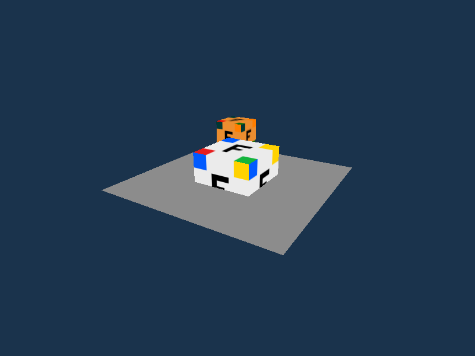
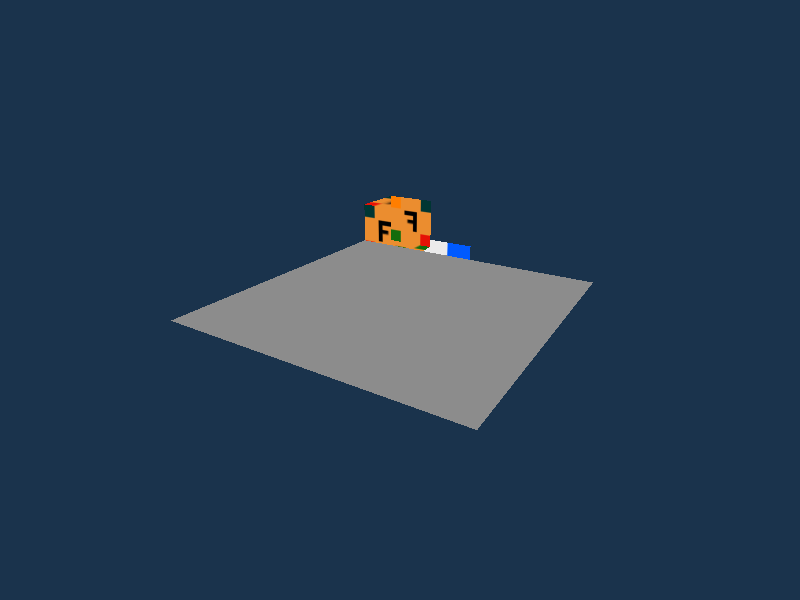
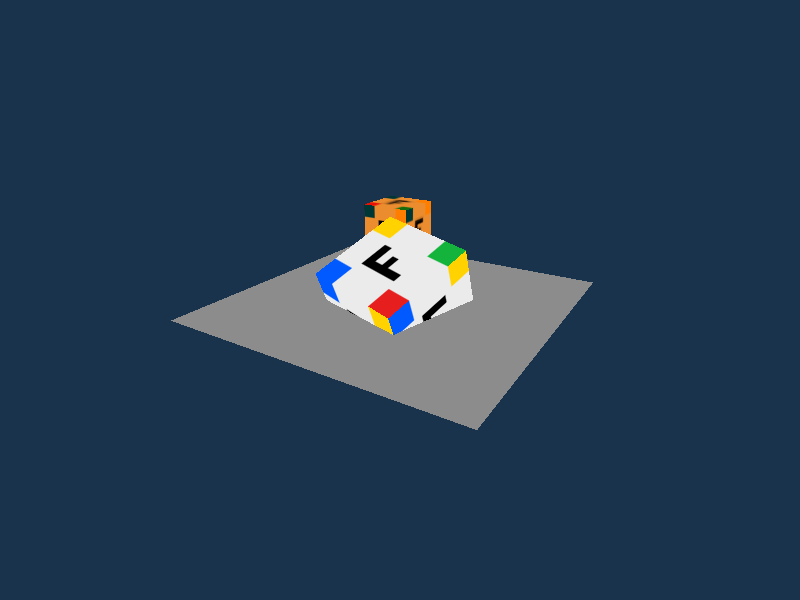
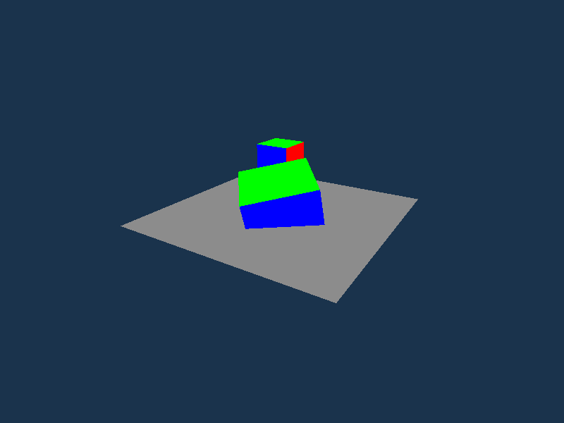

# Технические spike

Spike — короткий эксперимент, который проверяет рискованное техническое решение до основной разработки. Код spike лежит в [`spikes/`](../spikes/) и **не является частью движка**: в `Engine3D.*` переносятся только проверенные решения, описанные ниже. Порядок работ — в [плане](../project_plan.md), контракты — в [архитектуре](architecture.md) и [API](api.md).

| Spike | Issue | Статус |
|---|---|---|
| [OpenTK: окно, матрицы, depth, текстура, закрытие](#opentk-spike-issue-5) | #5 | Выполнен на ноутбуке разработчика; прогон на целевом ноутбуке **ещё не выполнен** |

## OpenTK spike (issue #5)

**Цель:** проверить самый рискованный путь P0 — окно OpenTK, передачу матриц `System.Numerics` в GLSL, depth test, текстуру по UV и корректное закрытие — и записать принятые соглашения до задачи 1.3 и создания solution (#6).

**Итог:** все пункты чек-листа #5 подтверждены на стенде разработчика. Найдена одна неочевидная ловушка — диапазон глубины проекции `System.Numerics` (см. [соглашения](#принятые-соглашения)).

### Стенд

| Параметр | Ноутбук разработчика | Целевой ноутбук |
|---|---|---|
| ОС | Linux Mint 22.2 (x64) | _заполнить_ |
| .NET SDK / runtime | 10.0.112 / 10.0.12 | _заполнить_ |
| OpenTK | 4.9.4 (GLFW 3.4 из `OpenTK.redist.glfw`) | _заполнить_ |
| GPU | Intel UHD Graphics (Alder Lake-P, ADL GT2) | _заполнить_ |
| Драйвер | Mesa 25.2.8 | _заполнить_ |
| Контекст | запрошен OpenGL 3.3 core, получен 4.6 core, GLSL 4.60 | _заполнить_ |
| Результат | все проверки ниже пройдены | _заполнить_ |

Версии GL, GPU и драйвера программа печатает при запуске — для целевого ноутбука достаточно скопировать вывод.

> Целевой framework — .NET 10 (`net10.0`, LTS, поддержка до ноября 2028), как зафиксировано в [плане](../project_plan.md).

### Как запустить

**Окружение.** Нужен .NET 10 SDK. Остальное (OpenTK, GLFW, декодер PNG) NuGet скачает сам при первой сборке.

- Linux (Ubuntu 24.04 / Mint 22): `sudo apt install dotnet-sdk-10.0`
- Windows: `winget install Microsoft.DotNet.SDK.10` (на Windows spike пока не проверялся)
- VS Code: расширение **C# Dev Kit** — запуск, отладка и вкладка Testing.

**Программа:**

```bash
cd spikes/OpenTkSpike
dotnet run                                              # интерактивный режим
dotnet run -- --frames 90 --screenshot /tmp/shot.png   # 90 кадров, сохранить последний, закрыть
dotnet run -- --frames 60 --cycles 10                   # 10 циклов «открыть — показать — закрыть»
dotnet run -- --compare a.png b.png --max-diff-percent 0.05   # сравнить два кадра
```

| Параметр | Назначение |
|---|---|
| `--frames N` | Закрыть окно после N показанных кадров |
| `--cycles N` | N раз подряд создать и закрыть окно в одном процессе; после каждого цикла печатается память |
| `--screenshot PATH` | Сохранить последний кадр в PNG (нужен `--frames`) |
| `--depth on\|off` | Начальное состояние depth test |
| `--cull on\|off\|front` | Back-face culling: `on` отбрасывает задние грани, `front` — лицевые (контрольный режим, имитирует неверный обход) |
| `--texture on\|off` | `off` — «цветной куб»: грани окрашены базовыми цветами материала вместо текстуры |
| `--angle RADIANS` | Зафиксировать угол поворота куба — кадры становятся воспроизводимыми побайтно |
| `--fail-at-frame N` | Намеренно вызвать ошибку OpenGL на кадре N (проверка обработки ошибок) |
| `--compare A B [--max-diff-percent P] [--min-diff-percent P]` | Отдельный режим: доля отличающихся пикселей двух PNG; код возврата 1 вне границ |

| Управление в окне | Действие |
|---|---|
| ЛКМ + мышь | Облет камеры вокруг центра сцены |
| Колесо | Приближение / отдаление |
| `Space` | Пауза вращения куба |
| `D` | Включить / выключить depth test |
| `C` | Включить / выключить back-face culling |
| `T` | Текстура / цветные грани |
| `Esc` | Выход |

**Тесты** (без окна и GPU, подходят для CI):

```bash
cd spikes/OpenTkSpike.Tests
dotnet test
```

**Smoke-тест окна** — [smoke-test.sh](../spikes/OpenTkSpike/smoke-test.sh), запуск из корня репозитория: `bash spikes/OpenTkSpike/smoke-test.sh`. Он проверяет:

1. 10 циклов «открыть — 30 кадров — закрыть» без исключений, ресурсы освобождаются в каждом цикле;
2. внедренная ошибка OpenGL (`--fail-at-frame 5`) обнаруживается именно на кадре 5, процесс завершается с ошибкой, GPU-ресурсы при этом освобождены;
3. culling: кадр с `--cull on` совпадает с кадром без culling (≤ 0,05 % пикселей), а с `--cull front` отличается (≥ 1 %);
4. сохраняет контрольные кадры: текстура, цветной куб, depth off.

**CI.** Workflow [`Spikes`](../.github/workflows/spikes.yml) запускается при изменениях в `spikes/` и содержит два job: `opentk-spike` — `dotnet test`; `opentk-spike-smoke` — smoke-тест в виртуальном дисплее (Xvfb) с программным OpenGL Mesa (llvmpipe, OpenGL 4.5 core). Логи и кадры smoke-теста доступны в артефакте `spike-smoke` каждого запуска. CI проверяет поведение, а не производительность и не картинку на реальном GPU — это ручная проверка на стенде.

### Что на экране

Большой куб с контрольной текстурой вращается в центре; серая плоскость режет его пополам; позади — маленький куб с той же текстурой, тонированной в оранжевый. Объекты намеренно рисуются в «неудобном» порядке — дальние после ближних, — чтобы без depth test ошибка была видна сразу.

| Depth test включен | Depth test выключен |
|---|---|
|  |  |
| Плоскость скрывает нижнюю половину куба, большой куб перекрывает маленький. | Плоскость, нарисованная последней, закрывает почти всю сцену; у маленького куба видна зеркальная «F» задней грани, нарисованной поверх передней. |

| Контрольная текстура | «Цветной куб» (`--texture off`, клавиша `T`) |
|---|---|
|  |  |
| 4 цветных угла и несимметричная буква «F». На каждой грани «F» читается нормально, если смотреть на грань снаружи; цвета углов совпадают с расчетом (левый нижний угол UV — красный). Переворот или зеркало были бы видны сразу. | Каждая грань окрашена базовым цветом материала: +X красный, −X голубой, +Y зеленый, −Y пурпурный, +Z синий, −Z желтый. Камера стоит со стороны +X/+Y/+Z, поэтому видны красная, зеленая и синяя грани. |

### Результаты по чек-листу #5

| Пункт | Результат | Чем подтверждено |
|---|---|---|
| Минимальный экспериментальный проект | `spikes/OpenTkSpike` (net10.0) + `spikes/OpenTkSpike.Tests` (xUnit) | Сборка без ошибок и предупреждений |
| Окно OpenTK | Окно 800×600, VSync, закрытие крестиком / `Esc` / по счетчику кадров | Ручной запуск, `--frames` |
| Цветной куб | Индексный куб, матрицы `System.Numerics`, перспектива, вращение, орбитальная камера; режим цветных граней `--texture off` / `T` | Скриншоты, ручная проверка |
| Depth test на перекрытии | Корректно с включенным depth; ожидаемая поломка без него | Скриншоты выше, переключение `D` |
| Контрольная текстура | PNG → StbImageSharp → RGBA8 + mipmaps; ориентация верна | Скриншоты, сверка цветов углов |
| Несколько запусков и закрытий | 10 и 60 циклов в одном процессе, 3 отдельных процесса подряд — без исключений и ошибок OpenGL; при ошибке ресурсы тоже освобождаются | `--cycles`, `glGetError` после загрузки, **в каждом кадре** и после освобождения; `--fail-at-frame`; smoke-тест в CI |
| Версии .NET / OpenTK / GPU / драйвера | Записаны в таблицу [стенда](#стенд) | Вывод программы |
| Конвенция матриц | Записана ниже, подтверждена тестами | 27 тестов `dotnet test` (матрицы, проекция, примитивы, строки, параметры) |

**Ошибки и освобождение ресурсов.** Ошибки OpenGL проверяются в конце каждого кадра, поэтому обнаруживаются на том кадре, где случились. Исключение прерывает `Run`; тогда GPU-ресурсы освобождает `Dispose` окна (пока жив контекст), при обычном закрытии — `OnUnload`. Оба пути проверены: `--fail-at-frame 5` дает `OpenGL errors while rendering frame 5: InvalidEnum` и сообщение `GPU resources released.`

**Память при повторных запусках:** за 60 циклов рабочий набор процесса вырос со 121 до 125 MiB за первые ~10 циклов и дальше держался на 125–126 MiB (прогрев кэшей драйвера); управляемая куча стабильна (~186 KiB). Признаков утечки окна, контекста или GPU-ресурсов нет.

### Принятые соглашения

1. **Матрицы.** `System.Numerics` умножает вектор-строку (`v' = v * M`) и хранит матрицу построчно (M11, M12, …); GLSL читает те же 16 чисел по столбцам, то есть видит транспонированную матрицу. Поэтому:
   - в C#: `model = scale * rotation * translation`, полное преобразование `model * view * projection`;
   - загрузка: `glUniformMatrix4fv(..., transpose: false, ...)`;
   - в шейдере: `gl_Position = u_projection * u_view * u_model * vec4(position, 1.0)`.
2. **Проекция — ловушка.** `Matrix4x4.CreatePerspectiveFieldOfView` дает глубину NDC в `[0, 1]` (как Direct3D), а OpenGL ожидает `[-1, 1]`. Картинка при этом выглядит *почти* правильно, но теряется половина точности depth-буфера и не отсекается геометрия ближе near-плоскости. Решение spike: умножить проекцию на поправку `z' = 2z − w` ([GlProjection.cs](../spikes/OpenTkSpike/GlProjection.cs)). Оба поведения зафиксированы тестами.
3. **Оси и камера.** Правая система координат, `Y` вверх, камера смотрит вдоль `−Z` пространства вида (`CreateLookAt`) — как в архитектуре.
4. **UV и PNG.** UV `(0, 0)` — левый нижний угол изображения. PNG и StbImageSharp хранят строки сверху вниз, `glTexImage2D` считает первую строку нижней, поэтому строки переворачиваются при загрузке на GPU — в OpenGL-слое, как требует архитектура.
5. **Геометрия.** Вершина = позиция + UV (как `Vertex` в API). Треугольники — против часовой стрелки при взгляде снаружи: проверено тестом для всех 12 треугольников куба и в рендере — кадр с back-face culling совпадает с кадром без него (0 пикселей различия на углах 0,7 и 4,0 рад; 1 пиксель из 480 000 на 2,3 рад — совпадение глубин на силуэтном ребре), а culling лицевых граней меняет ≈ 8,5 % кадра. Куб — 24 вершины и 36 индексов: у общей геометрической вершины на разных гранях разные UV.
6. **Материал.** Базовый цвет и необязательная текстура; итоговый цвет = цвет текстуры × базовый цвет. Одна GPU-текстура используется двумя материалами, один GPU-меш — двумя объектами.

### Рекомендации для контракта 1.3

- `Core` считает `Transform`, `Camera.View` и проекцию в `System.Numerics` по соглашениям выше; поправка глубины и `transpose: false` живут только в `Engine3D.OpenGL`. Контракт должен явно указать, что `Core` отдает проекцию в соглашении `System.Numerics` (`[0, 1]`).
- Контекста OpenGL 3.3 core достаточно для P0.
- Декодер изображения — StbImageSharp (Unlicense OR MIT, без нативных зависимостей).
- Порядок обхода проверен тестами и в рендере — back-face culling (`CCW` = лицевая сторона) можно включать; для замкнутых мешей он не меняет картинку. Плоскость при этом видна только сверху.
- Ошибки OpenGL в рендерере #9: как минимум одна проверка `glGetError` на кадр; в Debug-сборке лучше debug-callback (`KHR_debug`) — ошибка приходит сразу, с описанием. GPU-ресурсы освобождать и при исключении из цикла, не только при штатном закрытии.
- `GameWindow.Run()` блокирует поток до закрытия, а `Close()` из callback корректно завершает цикл — это совместимо с `Engine.Run` + `RequestClose` из API.

### Что не проверено

- **Целевой ноутбук** — обязательный критерий приемки #5: заполнить таблицу стенда, выполнить интерактивную проверку, `--cycles 10` и `dotnet test`.
- Windows и экраны с HiDPI (viewport считается по `FramebufferSize`, но на HiDPI не проверялся).
- CI использует программный OpenGL (llvmpipe): он подтверждает поведение (циклы, ошибки, culling), но не заменяет проверку на реальном GPU.
- Точный порядок и частота callbacks `GameWindow` (обновление/кадр) при нестандартных `UpdateFrequency` — spike использует настройки по умолчанию.
- Загрузка текстуры до `Run`: декодирование PNG не требует контекста, но загрузка на GPU в spike выполняется внутри `OnLoad`.

### Файлы spike

| Файл | Назначение |
|---|---|
| [Program.cs](../spikes/OpenTkSpike/Program.cs), [SpikeOptions.cs](../spikes/OpenTkSpike/SpikeOptions.cs) | Точка входа, параметры, циклы запуска |
| [ImageCompare.cs](../spikes/OpenTkSpike/ImageCompare.cs), [smoke-test.sh](../spikes/OpenTkSpike/smoke-test.sh) | Сравнение кадров и автоматическая проверка окна (локально и в CI) |
| [SpikeWindow.cs](../spikes/OpenTkSpike/SpikeWindow.cs) | Окно, шейдеры, сцена, управление, проверка ошибок GL |
| [Primitives.cs](../spikes/OpenTkSpike/Primitives.cs) | `Vertex`, куб и плоскость |
| [GpuMesh.cs](../spikes/OpenTkSpike/GpuMesh.cs), [GpuTexture.cs](../spikes/OpenTkSpike/GpuTexture.cs), [ShaderProgram.cs](../spikes/OpenTkSpike/ShaderProgram.cs) | GPU-ресурсы и их освобождение |
| [GlProjection.cs](../spikes/OpenTkSpike/GlProjection.cs) | Поправка диапазона глубины |
| [OrbitCamera.cs](../spikes/OpenTkSpike/OrbitCamera.cs) | Облет камеры мышью |
| [Screenshot.cs](../spikes/OpenTkSpike/Screenshot.cs), [ImageRows.cs](../spikes/OpenTkSpike/ImageRows.cs) | Сохранение кадра, переворот строк |
| [Assets/](../spikes/OpenTkSpike/Assets/) | Контрольная текстура и скрипт ее генерации (создана командой) |
| [OpenTkSpike.Tests/](../spikes/OpenTkSpike.Tests/) | Тесты матриц, проекции, примитивов, переворота строк и разбора параметров |

Сторонние пакеты и их лицензии — в [THIRD_PARTY.md](../THIRD_PARTY.md).
