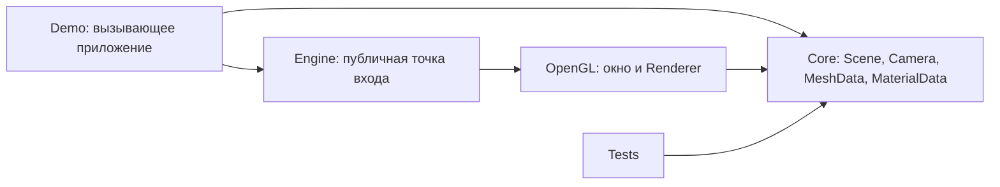
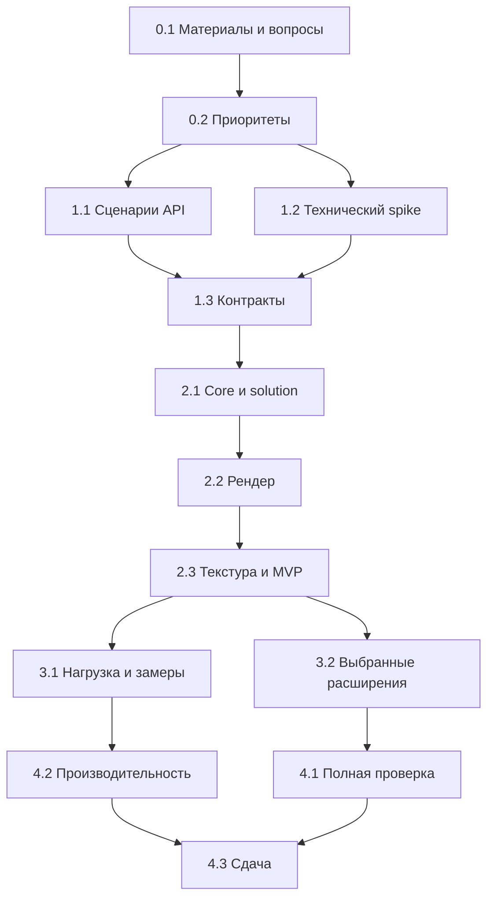

# План разработки учебного 3D-графического движка на C#

**Статус:** готовый документ первого этапа планирования, 27.09.2026. Он задает рабочий объем и порядок разработки; реализация движка еще не начиналась.

**Основа:** расшифровка лекции преподавателя, 15 страниц, 0:00–88:33; три фотографии доски; черновик сокомандника, 15 страниц. Исходные файлы не опубликованы в этом репозитории; их происхождение и роль описаны в [источниках](docs/sources.md). Черновик — предложение команды, а не дополнительное задание преподавателя. Упомянутые в лекции ссылка и оглавление книги недоступны; выводы, зависящие от них, оставлены открытыми.

**Правило чтения:** «преподаватель» означает подтвержденное лекцией; «решение проекта» — выбранный нами способ выполнить задание. Неопределенности не блокируют рабочий план: для каждой принята временная граница и указан момент технической проверки. Изменение объема позднее фиксируется с причиной.

**Краткое резюме:** создаем на C# небольшой 3D-графический движок с публичным API, сценой, камерой, полигональными примитивами, базовой текстурой и отдельной демонстрацией. Для полной выбранной версии проверяем сцену около 1000 простых объектов и документируем FPS на конкретном ноутбуке. Архитектура — `Core` + `OpenGL` + `Demo` + `Tests`; игровой логики, физики и редактора нет. Первое задание преподавателя закрывается требованиями, приоритетами, архитектурой и API; реализация идет после этого документа. **Первый технический шаг после планирования** — короткая проверка OpenTK, матриц, depth и текстуры, описанная в этапе 1.2.

## 1. Исходное задание и ожидаемый результат

Преподаватель сформулировал командный проект: сделать **трехмерный графический движок**, работающий с простыми 3D-примитивами, полигонами, текстурами и множеством моделей. Это библиотека с внешним API и демонстрацией возможностей, а не игра и не редактор. Команда сама выбирает конкретный набор функций и приоритеты. Цель первого задания — **список требований, их приоритеты, содержательная архитектура и проект API**; реализация основной части выбранной функциональности относится ко второму заданию. Источник: лекция, с. 2–3 (3:50–8:49), с. 5–8 (16:52–40:38).

На первой защите нужно уметь объяснить, **что войдет в движок, почему это реализуемо в срок, как внешняя программа им воспользуется, как компоненты связаны и как команда проверит работу**. Первая часть оценена преподавателем примерно в неделю, вторая — еще примерно в две недели после нее; это ориентир из речи, а не календарные даты сдачи. Источник: лекция, с. 3 (6:54–8:49), с. 8 (32:58–37:11).

Вторая половина лекции, начиная с 40:38, разбирает **плоский векторный движок и PDF-читалку как учебный пример проектирования**. Первая фотография доски относится к этому примеру: на ней видны сцена, хранение объектов, координаты, отображение сцены, точки/прямые/кривые, текстуры, сложные объекты и API. Вторая фотография показывает пример разделения UI, системного модуля, библиотеки объектов, ядра и рендера. Это подтверждает **способ декомпозиции**, а не обязательность точек/кривых, PDF-формата, редактора или конкретного числа сборок в нашем 3D-движке. Переносим метод: требования → компоненты → API → проверка сценариями. Источник: лекция, с. 8–15 и фотографии 1–2; см. [описание источников](docs/sources.md).

Третья фотография доски содержит короткий список «Треб», «API», «Архит», «Репо + CI + CR» (последние буквы читаются менее уверенно). Он согласуется с устной формулировкой первого задания и усиливает практический смысл ранней подготовки репозитория и CI. Расшифровку `CR` как code review используем с оговоркой; требования о конкретном числе ревьюеров берем из речи преподавателя, а не из этой надписи.

## 2. Что требует преподаватель

### 2.1. Явные требования и формулировки

| ID | Подтверждено лекцией | Где сказано | Как проверять позднее |
|---|---|---|---|
| L-01 | Командный 3D-графический движок; стек команда выбирает сама. C# зафиксирован заказчиком этого плана. | с. 1–2, 0:00–3:50; с. 6, 22:37–24:55 | Запускаемый C# solution с отдельным API движка. |
| L-02 | Базовая работа с простыми 3D-примитивами, полигонами и текстурами. | с. 2, 3:50–4:59 | Сцена из примитивов и текстур видна в окне. |
| L-03 | Для первого задания составить список требований, выбрать приоритеты, оценить реализуемость, описать архитектуру и заранее продумать внешний API. Полностью формальный UML не нужен. | с. 2–3, 3:50–6:54; фото 3 | Документы требований/архитектуры/API и 2–3 пройденных сценария использования. |
| L-04 | Во втором задании реализовать основную часть **выбранной и приоритизированной** функциональности. Все мыслимые функции охватывать не требуется. | с. 5, 16:52–20:19; с. 8, 32:58–37:11 | Демонстрация выбранного набора с объяснением отложенных функций. |
| L-05 | Одновременно поддерживать порядка тысячи или чуть более моделей; на достаточно мощном ноутбуке при максимальной демонстрационной нагрузке FPS не должен надолго сильно падать ниже ~24. Значения приблизительные, точный стенд не задан. | с. 6, 22:37–24:55 | Повторяемый нагрузочный сценарий и измерение FPS на зафиксированном устройстве. |
| L-06 | Графический движок отвечает за отображение сцены, моделей, камеры, геометрических изменений. Игровая логика, физика и коллизии в задании не нужны. Прозрачность/зеркала можно не делать. | с. 6–7, 24:55–32:58 | Публичный API позволяет показать сцену без игровых правил; отсутствуют игровые подсистемы. |
| L-07 | Нужны несколько smoke-сценариев, автоматических, полуавтоматических или ручных. Нужны разнообразные тесты, в том числе интеграционные и регрессионные. | с. 5–6, 20:19–22:37; с. 6, 24:55–32:58 | Зафиксированные команды запуска тестов и сценарий визуальной проверки. |
| L-08 | Следить за узкими местами, утечками и падениями; не стремиться обогнать промышленные движки и не требовать 4K. | с. 5–6, 16:52–24:55 | Запуск и завершение без сбоев; замеры по выбранному сценарию. |
| L-09 | Организовать командную работу: распределить зоны ответственности и загрузку, фиксировать вклад, правила задач/решений/репозитория/PR/review и таблицу состава групп. | с. 3–5, 8:49–16:52 | Таблица ролей, задачи с владельцами, вклад в коммиты/PR. |
| L-10 | Учитывать лицензии сторонних моделей и текстур. Преподаватель рекомендует живое ревью каждого PR минимум двумя людьми, не считая нейросетей. Репозиторий и CI он называет разумной ранней подготовкой; краткий список на фото 3 также указывает «Репо + CI + CR» (чтение `CR` предварительное). | с. 3, 6:54–9:58; с. 8, 37:11–40:38; фото 3 | Реестр сторонних ассетов, политика PR, успешные проверки CI. |

**Точность формулировок.** L-05 не означает официальную фиксированную приемку «ровно 1000 объектов при 1920×1080 и всегда ≥24 FPS». L-10 разделяет просьбу зафиксировать процесс, **рекомендацию** о двух ревьюерах и **рекомендацию** рано настроить CI. В лекции не установлена обязательность GitHub вместо GitLab.

### 2.2. Неявные требования для работоспособного результата

Это инженерные выводы, **не отдельные требования преподавателя**:

- Сцене нужны координаты, положение и ориентация объектов, камера, преобразование из 3D в изображение и правильное перекрытие ближних/дальних полигонов. Иначе L-01/L-02 невыполнимы.
- Нужны ясные контракты для вершин/индексов/UV, текстур и владения графическими ресурсами. Иначе невозможно независимо писать сцену, загрузку и рендерер.
- Нужна небольшая вызывающая программа (`Demo`), демонстрирующая публичный API. Иначе невозможно убедиться, что получилась библиотека движка, а не одноразовая программа.
- Нужны фиксированный стенд и нагрузочная сцена для честной проверки приблизительного ориентира L-05. Разрешение и длительность измерения назначает команда.
- Нужны инструкции сборки/запуска и список ограничений, чтобы преподаватель смог воспроизвести демонстрацию.
- При выборе OpenGL нужны минимальные шейдеры и управление GPU-ресурсами как часть реализации рендера. Это техническая необходимость выбранного пути, а не отдельное требование к «системе пользовательских шейдеров».

### 2.3. Неопределенности и вопросы к преподавателю/команде

| Вопрос | Статус и безопасное временное решение |
|---|---|
| Какие сведения давало упомянутое преподавателем оглавление книги? | Пользователь передал все доступные источники; оглавления нет. Не дополнять список обязательных функций догадками. Если преподаватель уточнит ожидания на консультации, обновить требования; работу по текущим материалам не блокировать. |
| Какой точный набор функций нужен для зачета? | Преподаватель оставил приоритизацию команде. Рабочий объем P0-01…P0-09 выбран и записан в [требованиях](docs/requirements.md); он не выдается за официальный список преподавателя. |
| Достаточно ли процедурных примитивов или обязателен импорт модели? Какой формат? | В лекции формат не зафиксирован. Для MVP достаточно куба/плоскости; OBJ предложен как следующий шаг из черновика, если подтвердится время/смысл. |
| Как понимать «работа с текстурами»? | Предлагаем UV + загрузку одного распространенного растрового формата + нанесение на mesh. Несколько слотов/PBR в лекции не зафиксированы. |
| Нужны ли свет, анимация и culling? | Освещение и анимация в лекции не объявлены обязательными; culling приведен как относящийся к графическому движку. Решить после MVP и замеров. |
| Какая ОС обязательна? | Преподаватель допускает Windows и сомневается в необходимости сложной кроссплатформенности. Для нашей команды предлагается Windows как первый стенд, второй стенд — только при наличии времени/командной потребности. |
| Какой ноутбук, разрешение, состав сцены и допустимая длительность просадки FPS? | В лекции точные значения не зафиксированы. Команда фиксирует собственный воспроизводимый профиль замера; при необходимости показывает преподавателю. |
| Сколько участников и кто на какой срок доступен? | В лекции говорится примерно о 9–10 участниках команды; фактический состав и загрузка пока неизвестны. |
| Что именно сдавать кроме первого задания и работающего движка: отчет, презентацию, UML, ссылку на репозиторий? | Фото 3 подтверждает краткий набор «требования/API/архитектура/репозиторий + CI», но отчет, презентация, строгий UML и конкретная ссылка на хостинг в материалах не зафиксированы. |
| Какие точные календарные дедлайны и формат консультаций? | В лекции только относительная оценка «неделя + две недели». Даты и порядок сдачи уточнить. |

## 3. Что должно быть разработано и предъявлено

### По заданию

1. Для первой части — список требований с приоритетами, описание архитектуры и набросок внешнего API, проверенный сценариями. Рабочий объем уже зафиксирован; команда может корректировать его с записью причины.
2. Для второй части — работающий 3D-графический движок на C# с выбранными базовыми возможностями: примитивы/полигоны, текстуры, сцена с несколькими моделями, камера, рендер.
3. Несколько проверок возможностей движка и тесты; демонстрация живой работы и проверки производительности на выбранном ноутбуке.
4. Организация работы команды с зафиксированным вкладом, правилами внесения изменений и учетом лицензий ассетов.

### Рекомендуемые рабочие артефакты

| Артефакт | Почему нужен | Статус |
|---|---|---|
| `project_plan.md` | Единая карта работ и чек-лист | Создается сейчас. |
| `docs/requirements.md`, `docs/architecture.md`, `docs/api.md`, `docs/implementation_outline.md` | Позволяют отдельно обсуждать первое задание, фиксировать решения и раздать конкретные задачи | Подготовлены [требования](docs/requirements.md), [архитектура](docs/architecture.md), [проект API](docs/api.md) и [псевдокод разработки](docs/implementation_outline.md); технические гипотезы помечены для будущей проверки. |
| `README.md` | Сборка, запуск, управление демо, ограничения | К моменту MVP. |
| `docs/team.md`, `docs/development-process.md` | Состав, нагрузка, PR/review и правила решений | [Зоны работы и таблица участников](docs/team.md), [процесс разработки](docs/development-process.md) подготовлены; GitHub-репозиторий и базовый документационный CI оформляются, фактические имена команды и build/test CI заполняются на этапе 0.3. |
| `THIRD_PARTY.md` | Источники и лицензии внешних библиотек/ассетов | До добавления первого стороннего ассета. |
| Диаграмма компонентов и 2–3 сценария API | Проверить, что архитектура действительно обслуживает требования | В составе `architecture.md` и `api.md`; формальный UML необязателен. |
| Тесты и demo-сцены | Проверка геометрии, интеграции и поведения на экране | Наращивать вместе с функциями. |
| Отчет, презентация, отдельный PDF | В предоставленных материалах это требование не зафиксировано | Делать только после уточнения формата сдачи или при явной пользе. |

## 4. Технологический стек и границы выбора

**Выбранный рабочий стек:** C#, установленный здесь .NET 8 SDK (`dotnet --info`: 8.0.425), OpenGL через OpenTK, `System.Numerics` для данных сцены и математики, тестовый проект на `dotnet test`. .NET 8 позволяет начать без смены окружения; если проект уйдет за ноябрь 2026 года, стоит обновить целевой framework, так как поддержка .NET 8 тогда заканчивается. [Поддержка версий .NET](https://learn.microsoft.com/en-us/dotnet/core/releases-and-support).

OpenTK предоставляет C# API к OpenGL и окно/ввод; это **рабочий кандидат**, а не указание преподавателя. Перед закреплением зависимости выполнить короткий технический spike: окно → треугольник → вращающийся куб → текстура → закрытие без ошибок на целевом ноутбуке. [Официальный учебник OpenTK](https://opentk.net/learn/chapter1/1-creating-a-window.html), [репозиторий OpenTK](https://github.com/opentk/opentk).

`System.Numerics` дает `Vector3`, `Quaternion`, `Matrix4x4`, но у матриц есть конкретная конвенция умножения. Нужно проверить порядок матриц и передачу в OpenGL тестовой геометрией, прежде чем раздать работу нескольким людям. [Документация Matrix4x4](https://learn.microsoft.com/en-us/dotnet/api/system.numerics.matrix4x4). Выбор библиотеки изображений и формата импорта модели сделать после spike и проверки лицензий; до этого не включать лишние пакеты.

**Пока не планируются:** Vulkan, второй graphics backend, движок физики, редактор, сетевой слой, база данных, микросервисы, собственная математика ради самой математики, PBR и сложная система материалов.

## 5. Предварительная архитектура C#

### 5.1. Модули и ответственность

| Модуль | Ответственность | Не отвечает за |
|---|---|---|
| `Engine3D.Core` | `Scene`, `SceneObject`, `Transform`, `Camera`, `MeshData` (вершины/индексы/UV), `MaterialData` (цвет + опциональная текстура), генерация базовых примитивов, проверки данных | Окно, ввод, вызовы OpenGL, игровые правила |
| `Engine3D.OpenGL` | Окно/контекст, GPU-буферы, простые шейдеры, depth test, загрузка текстуры, рендер кадра, освобождение ресурсов, публичная точка входа `Engine` | Физика, коллизии, хранение логики сцены |
| `Engine3D.Demo` | Создание сцены через публичный API, управление камерой/объектом для показа, smoke- и нагрузочный режимы | Внутренние OpenGL-вызовы |
| `Engine3D.Tests` | Проверки геометрии/матриц/валидности мешей и интеграции доступных без окна компонентов | Замена визуальной приемки и замера GPU-производительности |

`Core` не зависит от `OpenGL`; `OpenGL` зависит от `Core`; `Demo` зависит от публичных частей обоих; `Tests` проверяет `Core` и, где полезно, интеграцию. База данных и CLI не нужны: демо — оконная программа, параметры запуска вроде `--stress` возможны позднее без отдельного CLI-проекта.



### 5.2. Модель данных и алгоритмы

- `MeshData`: массив вершин с позицией и UV, индексные треугольники. Нормали добавлять при включении освещения, не объявлять их обязательными заранее.
- `SceneObject`: ссылка на mesh и материал плюс `Transform`; повторное использование одного mesh многими объектами важно для ~1000 инстансов.
- `Transform`: позиция, вращение, масштаб; `Camera`: видовая и проекционная матрицы. Для первой версии без parent/child.
- `MaterialData`: базовый цвет и опциональная текстура. Пять `TextureSlot`, PBR-параметры и несколько источников света из черновика отложены.
- Внутренний GPU-кэш связывает данные mesh/texture с буферами/объектами OpenGL. **Выбранное правило:** GPU-ресурсами владеет `Engine` и освобождает их при завершении; `Scene`, `MeshData` и `TextureData` содержат только управляемые данные и не требуют отдельного `Dispose`. Раннее удаление ресурсов проработать после MVP, если измерения покажут потребность.
- Рендер кадра: очистка цвета/глубины → параметры камеры → обход видимых объектов → матрица модели → привязка mesh/материала/текстуры → рисование индексированных треугольников → обмен буферов. Frustum culling вводить только при показанном узком месте.

### 5.3. Публичный API: минимальный контракт, не окончательные сигнатуры

Пользователь должен суметь создать `Engine`, `Scene` и `Camera`, добавить примитив с материалом/текстурой, изменить `Transform`, нарисовать кадры и корректно закрыть окно. Внутренние GPU handle, шейдерные программы и буферы не должны становиться частью обычного API. Подробные проектные контракты записаны в [API](docs/api.md), а порядок действий по модулям — в [псевдокоде](docs/implementation_outline.md).

Выбранный путь: `Engine.Create(options)` → `CreateCubeMesh()` → `scene.Add(object)` → `Engine.Run(scene, camera, onUpdate)` → `Dispose`. `Run` владеет циклом событий, а callback приложения меняет данные сцены. Отдельного `Initialize` и второго публичного цикла для P0 нет. В коротком OpenTK spike проверить осуществимость этого жизненного цикла и обновить контракт, если библиотека выявит конкретное препятствие.

### 5.4. Что полезно из черновика сокомандника и что меняется

**Берем как отправную точку:** `Engine`, `Scene`, `SceneObject`, `Transform`, `Camera`, повторно используемые `Mesh`/`Texture`, разделение ядра и рендера, пользовательские сценарии Initialize/Create Scene/Add/Render/Shutdown, исключение игровой логики.

**Решения по спорным пунктам черновика:**

1. Черновик называет собственный P0 «обязательным для зачета», хотя такого списка преподаватель не дал. У нас P0 — зафиксированный рабочий объем проекта, а не официальный минимум для зачета.
2. Импорт OBJ, иерархия объектов, источник света, 1920×1080, .NET-тип API, запрет push в `main`, полный CI-стек и формат лицензий — решения команды, не доказанные требования лекции.
3. В API черновика `Create()` уже может создавать контекст, а `Initialize()` делает еще одну неясную фазу. В нашем плане оставлены `Create` и один `Run`, без `Initialize`.
4. Черновик заранее выставляет `Parent/Children`, `WorldMatrix`, множество слотов текстур, logger, `TryLoad*` и иерархию исключений. Публичные обещания без реализации увеличивают объем первого задания; оставить только те, что нужны выбранному P0.
5. В черновике ответственность за `Dispose()` ресурсов одновременно связана с `ResourceManager`, `Application` и `Engine`. В нашем плане единственный владелец GPU-ресурсов — `Engine`; повторное использование mesh/texture проверить в нагрузочной сцене.
6. Предложение «macOS/Linux — целевые ОС, Windows не цель» противоречит нашему доступному стенду и не следует из лекции. Начинаем с Windows; переносимость оцениваем отдельно.
7. «1 единица = 1 метр» полезно для игры/физики, но для графического движка пока ничем не обосновано. Фиксируем только систему осей, единицы условные.

### 5.5. Псевдокод минимального сквозного сценария

```text
создать Engine и окно
создать один MeshData куба и один MeshData плоскости
загрузить собственную контрольную текстуру
создать Scene с двумя SceneObject, их MaterialData и Transform
задать Camera
запустить Engine.Run(scene, camera, onUpdate)
  в onUpdate изменять угол куба или положение камеры
  внутри рендера получать GPU mesh/texture из кэша по CPU-объекту
  очистить цвет и глубину, передать матрицы, показать объекты
при закрытии освободить Engine и все принадлежащие ему GPU-ресурсы
```

Для нагрузки добавить около 1000 объектов, ссылающихся на **один** mesh, и записать `RenderedFrames`, длительность, число треугольников, разрешение, VSync и характеристики ноутбука. Полная раскладка действий и проверок дана в [псевдокоде разработки](docs/implementation_outline.md). Никакой игровой физики или сценариев поведения в движке для этого пути не требуется.

## 6. Ориентировочная структура solution

```text
Engine3D.sln
src/
  Engine3D.Core/
    Scene/       # Scene, SceneObject, Transform, Camera
    Geometry/    # MeshData, Vertex, PrimitiveFactory
    Materials/   # MaterialData
  Engine3D.OpenGL/
    Engine.cs     # публичная точка входа
    Rendering/    # Renderer, shaders, buffers
    Resources/    # загрузка и владение GPU-ресурсами
  Engine3D.Demo/
    Program.cs
    Assets/       # только ассеты с подтвержденными лицензиями
tests/
  Engine3D.Tests/
docs/
  requirements.md
  architecture.md
  api.md
  implementation_outline.md
  team.md
  development-process.md
README.md
THIRD_PARTY.md
project_plan.md
```

Физические проекты добавлять по мере начала этапов. Наличие папки в схеме не требует сейчас создавать пустые каталоги. Если нагрузка окажется маленькой, `Core` и `OpenGL` остаются двумя библиотеками; дополнительные слои не нужны.

## 7. Детальная декомпозиция и план реализации

Каждая карточка дает работу, ожидаемый результат, зависимости, риск и критерий готовности. Номера используются далее в зависимостях и приоритетах.

**Рабочий чек-лист этапов:**

- [x] 0.1. Сверить все доступные источники и отделить пример векторного движка от задания.
- [x] 0.2. Зафиксировать P0/P1/P2 и критерии приемки в [рабочих требованиях](docs/requirements.md).
- [ ] 0.3. Зафиксировать состав команды, правила репозитория и подготовить CI.
- [x] 1.1. Проверить архитектуру по сценариям внешнего API; результаты записаны в [архитектуре](docs/architecture.md) и [API](docs/api.md).
- [ ] 1.2. Проверить OpenTK, матрицы, depth и текстуру коротким прототипом.
- [ ] 1.3. Зафиксировать общие контракты перед параллельной разработкой.
- [ ] 2.1. Собрать solution и модель сцены.
- [ ] 2.2. Провести первый кадр через публичный API.
- [ ] 2.3. Добавить текстуру и завершить MVP-сцену.
- [ ] 3.1. Измерить сцену с множеством объектов.
- [ ] 3.2. Добавить выбранные функции после MVP.
- [ ] 4.1. Провести автоматические и визуальные проверки.
- [ ] 4.2. Проверить производительность и устранить измеренные проблемы.
- [ ] 4.3. Подготовить воспроизводимую демонстрацию и документы.

### Этап 0. Подтверждение первого задания

#### 0.1. Сверить все доступные исходные материалы — выполнено для этой итерации

- **Что сделать:** сверить лекцию, три фотографии доски и черновик команды; отделить пример векторного движка от требований к 3D-проекту; отметить сведения, которых нет ни в одном доступном источнике.
- **Цель:** не принять учебный пример или предложение сокомандника за требование преподавателя.
- **Результат:** текущая таблица L-01…L-10 и список неопределенностей в этом плане. При переносе в `docs/requirements.md` сохранить ссылки на источники.
- **Зависимости:** нет.
- **Возможные проблемы:** низкая читаемость третьей фотографии и отсутствие оглавления книги; это не причина останавливать первую часть задания.
- **Как проверить:** каждое утверждение «обязательно» имеет источник; пример векторного движка не выдан за требование к 3D; все пробелы отмечены «не зафиксировано». Для имеющихся материалов критерий выполнен.

#### 0.2. Зафиксировать границы и приоритеты — выполнено для рабочего плана

- **Что сделать:** выбрать P0/P1/P2 и список исключений; пройтись по каждому пункту с оценкой трудоемкости.
- **Цель:** уложить проект в краткий учебный срок.
- **Результат:** [таблица P0-01…P0-09, P1/P2 и два проверенных по архитектуре сценария](docs/requirements.md) зафиксированы как рабочая база проекта.
- **Зависимости:** 0.1 выполнена по всем доступным материалам; недоступное оглавление не блокирует согласование объема.
- **Возможные проблемы:** желание включить слишком много эффектов.
- **Как проверить:** два сценария покрывают выбранный объем, а у каждого P0 есть источник, результат и способ проверки. Критерий выполнен на уровне планирования.

#### 0.3. Организовать команду и репозиторий — базовая настройка начата

- **Что сделать:** выяснить состав/доступность, назначить владельцев направлений, закрепить правила веток/PR/review, расширить CI после появления solution.
- **Цель:** дать возможность параллельной работе без конфликтов и невидимого вклада.
- **Результат:** [схема зон ответственности](docs/team.md) и [правила задач/PR/CI](docs/development-process.md) уже описаны; репозиторий и документационный CI подготовлены; фактический состав, карточки и build/test CI создаются при начале командной разработки.
- **Зависимости:** базовое 0.2 для распределения работы; репозиторий можно готовить параллельно 0.1.
- **Возможные проблемы:** отсутствующие участники, перегруженный ревьюер, длинная очередь PR.
- **Как проверить:** у каждой текущей задачи владелец и проверяющий; тестовый PR проходит согласованный процесс.

### Этап 1. Архитектура и проверка технического пути

#### 1.1. Пройти сценарии внешнего API — выполнено на уровне проектирования

- **Что сделать:** записать 2–3 сценария: текстурированный куб; множество объектов с камерой; штатное закрытие/повторный запуск. Нарисовать зависимости модулей и черновые C# сигнатуры только для P0.
- **Цель:** убедиться, что движком действительно сможет пользоваться внешняя программа.
- **Результат:** [описание архитектуры](docs/architecture.md) и [проект публичного API](docs/api.md) с ограниченным контрактом и двумя сценариями.
- **Зависимости:** 0.2.
- **Возможные проблемы:** лишние публичные сущности, несогласованное владение ресурсами.
- **Как проверить:** оба сценария проходят через перечисленные публичные действия без прямого доступа вызывающей программы к OpenGL; каждому действию соответствует тип/операция. Критерий выполнен на бумаге; проверка работоспособности остается в spike и MVP.

#### 1.2. Spike окна, матриц и текстуры

- **Что сделать:** отдельный выбрасываемый прототип на OpenTK/.NET: окно, треугольник, куб, depth test, PNG-текстура, корректное закрытие. Зафиксировать версию OpenGL, систему осей, порядок матриц, ограничения стенда.
- **Цель:** снять самые опасные технологические неизвестности до полной архитектуры.
- **Результат:** короткая заметка с результатом и минимальный прототип или решение сменить graphics API binding.
- **Зависимости:** 0.2; можно вести параллельно 1.1.
- **Возможные проблемы:** контекст не создается на ноутбуке, перевернута текстура, неправильно умножены матрицы.
- **Как проверить:** куб с разными сторонами и текстурой вращается, ближняя грань перекрывает дальнюю, окно закрывается без исключения.

#### 1.3. Заморозить контракты перед параллельной работой

- **Что сделать:** решить формат `Vertex/MeshData`, типы математики, координаты/UV, жизненный цикл окна, владение mesh/texture, ошибки загрузки, минимальный API.
- **Цель:** не заставить команды переписывать интеграцию.
- **Результат:** версия 1 проектных контрактов в `docs/api.md` и небольшие задачи по модулям.
- **Зависимости:** 1.1, 1.2.
- **Возможные проблемы:** преждевременное обещание будущих функций.
- **Как проверить:** разработчик рендера и разработчик сцены независимо понимают одинаковые типы и последовательность вызовов; пробный код клиента составляется без «заглушек на будущее».

### Этап 2. Минимальная рабочая версия

#### 2.1. Собрать solution и модель сцены

- **Что сделать:** создать проекты `Core/OpenGL/Demo/Tests`, `Scene`, `SceneObject`, `Transform`, `Camera`, `MeshData`, фабрику куба/плоскости и простые проверки данных.
- **Цель:** получить компилируемую основу с разделением данных и рендера.
- **Результат:** чистая сборка; тесты матриц и mesh.
- **Зависимости:** 1.3.
- **Возможные проблемы:** несогласованные координаты, вырожденные треугольники.
- **Как проверить:** `dotnet build` и `dotnet test` успешны; числовые проверки преобразований проходят.

#### 2.2. Реализовать минимальный рендер и публичный путь

- **Что сделать:** контекст, буферы, базовые шейдеры, depth test, камера, обход сцены, освобождение GPU-ресурсов; обеспечить один понятный способ запустить и остановить рендер.
- **Цель:** доказать сквозной путь от C# API до кадра на экране.
- **Результат:** демо с несколькими непрозрачными цветными примитивами.
- **Зависимости:** 2.1, результат spike 1.2.
- **Возможные проблемы:** несовпадение матриц CPU/GPU, поток владения контекстом, порядок Dispose.
- **Как проверить:** два объекта на разных глубинах отображаются верно, камера перемещается, штатное закрытие не дает падения.

#### 2.3. Нанести одну текстуру и оформить smoke-сцену

- **Что сделать:** добавить UV и один формат изображения, загрузку/применение текстуры, фиксированную демонстрационную сцену и краткую инструкцию запуска.
- **Цель:** закрыть базовую работу с текстурами, видимую преподавателю.
- **Результат:** MVP-демо с текстурированным вращающимся кубом и вторым объектом.
- **Зависимости:** 2.2.
- **Возможные проблемы:** ориентация UV, ошибки файла, неподтвержденная лицензия текстуры.
- **Как проверить:** текстура совпадает с контрольным рисунком, отсутствующий файл дает понятную ошибку, повторный запуск успешен.

### Этап 3. Основная реализация после MVP

#### 3.1. Подготовить сцену с множеством объектов и замеры

- **Что сделать:** повторно использовать mesh/texture для множества `SceneObject`; задать фиксированный профиль нагрузки, счетчик времени кадра/FPS и записать параметры стенда.
- **Цель:** проверить ориентир L-05, найти узкое место на реальном железе.
- **Результат:** воспроизводимая stress-сцена и протокол результатов.
- **Зависимости:** 2.3.
- **Возможные проблемы:** синхронизация по VSync скрывает реальные значения, частые выделения памяти, лишние draw calls.
- **Как проверить:** одинаковый сценарий запуска дает сопоставимые замеры; результаты содержат число объектов, разрешение, настройки, модель GPU/CPU, длительность.

#### 3.2. Расширить функциональность по фактическому приоритету

- **Что сделать:** выбрать из P1 импорт простого формата модели (например, OBJ), простое освещение/нормали, culling или элементарную анимацию только после оценки времени и замеров; для каждого добавить отдельную задачу и проверку.
- **Цель:** реализовать больше выбранных требований, не сорвав ядро проекта.
- **Результат:** одна или несколько дополнительных функций, показанных отдельным сценарием.
- **Зависимости:** 2.3; выбор конкретного P1 — после 3.1 по результатам замеров и оставшемуся времени.
- **Возможные проблемы:** импорт тянет сложные форматы/материалы; свет меняет формат вершины; culling может не ускорить простую сцену.
- **Как проверить:** каждое расширение имеет конкретную демо-проверку и не ломает MVP-сцену.

### Этап 4. Интеграция, тестирование и подготовка сдачи

#### 4.1. Проверить корректность и надежность

- **Что сделать:** добавить смысловые unit-тесты матриц/индексов/загрузчика, интеграционные проверки создания сцены и ресурсов, регрессионный запуск старых тестов, ручной визуальный чек-лист, повторные циклы запуска/закрытия.
- **Цель:** не полагаться на единственный успешный показ.
- **Результат:** зеленый CI и заполненный протокол smoke-проверок.
- **Зависимости:** 2.3, а для тестов P1 — 3.2.
- **Возможные проблемы:** GPU-тесты нестабильны на CI без дисплея; unit-тесты не видят визуальных дефектов.
- **Как проверить:** автоматические проверки проходят, визуальные сценарии воспроизводятся на целевом ноутбуке, известные ограничения записаны.

#### 4.2. Проверить производительность и устранить подтвержденные проблемы

- **Что сделать:** повторить 3.1 на согласованной машине; профилировать при отклонении, исправлять измеренное узкое место, проверить длительную работу и освобождение памяти.
- **Цель:** приблизиться к ориентиру преподавателя и доказать устойчивость.
- **Результат:** протокол до/после для существенных оптимизаций или честное ограничение при недостижении цели.
- **Зависимости:** 3.1, 4.1.
- **Возможные проблемы:** аппаратные различия, драйвер, слишком сложная нагрузочная сцена.
- **Как проверить:** выбранный сценарий соответствует согласованному критерию FPS, нет длительного ухудшения/роста памяти; отклонения объяснены.

#### 4.3. Подготовить передачу и демонстрацию

- **Что сделать:** обновить README, архитектуру/API, реестр лицензий, список вклада; провести показ «с чистого клона»: сборка, тесты, демо, нагрузочный режим, закрытие.
- **Цель:** сделать результат воспроизводимым и защищаемым.
- **Результат:** репозиторий и краткий сценарий защиты.
- **Зависимости:** 4.1, 4.2.
- **Возможные проблемы:** локальные абсолютные пути, недостающие ассеты/пакеты, недокументированные горячие клавиши.
- **Как проверить:** участник, не писавший демо, запускает проект по README на целевом компьютере без устных подсказок.

## 8. MVP

**Самая маленькая рабочая система:** внешний код создает `Scene` с двумя примитивами, назначает цвет/одну текстуру, задает `Camera`, запускает окно, видит корректную глубину, может изменить положение объекта или камеры и завершить программу без сбоя.

**В MVP входит:** C# solution; простая mesh-модель с UV; куб/плоскость; сцена/объект/transform/камера; OpenGL-рендер с минимальными шейдерами и depth test; одна текстура; публичный путь запуска; демо; несколько тестов математики и smoke-чек-лист.

**В MVP не входит:** OBJ/FBX/glTF-импорт, освещение, нормали как публичное требование, иерархия объектов, анимация, culling, прозрачность, отражения, физика, коллизии, редактор, PBR, сетевые функции. Это не отменяет возможного добавления после MVP по приоритету.

**После MVP:** прежде всего масштабирование сцены и измерение FPS; затем наиболее ценные P1 из 3.2. Пустые заглушки под несделанные функции не выдавать за поддержку.

## 9. Приоритеты

Это **рабочее решение проекта**, а не официальная рубрика преподавателя. Приоритет означает обязательность для **выбранного нами полного объема**, а не порядок календарного выполнения: нагрузку измеряем после MVP, но она остается P0 для готовой версии. Подробные источники и критерии см. в [требованиях](docs/requirements.md).

| ID | Выбранный P0 для полной версии | Приемочное свидетельство |
|---|---|---|
| P0-01 | Публичная C#-библиотека и отдельное демо | Демо не вызывает OpenGL напрямую. |
| P0-02 | Сцена с несколькими объектами и общим mesh | Один mesh используется многими объектами без копирования данных на каждый объект. |
| P0-03 | Индексные треугольники, куб и плоскость | Примитивы видны, неверные индексы отклоняются. |
| P0-04 | Transform и камера | Положение/поворот и ракурс меняются в ходе показа. |
| P0-05 | Рендер с корректной глубиной | Ближняя непрозрачная грань перекрывает дальнюю. |
| P0-06 | Базовый материал и текстура по UV | Контрольная PNG отображается в правильной ориентации. |
| P0-07 | Сцена около 1000 простых объектов и замер | Есть воспроизводимый протокол FPS на указанном ноутбуке с параметрами сцены. |
| P0-08 | Корректное завершение и проверки | Повторные запуски, unit/integration/smoke и регрессия проходят. |
| P0-09 | Документы первого задания | Требования, архитектура и API проходят два сценария на бумаге. |

| Приоритет | Задачи/функции | Причина |
|---|---|---|
| Critical / P0 | P0-01…P0-09: проектирование, базовый рендер, текстура, проверка нагрузки, тесты, устойчивость и документы; задачи 0.1–0.3, 1.1–1.3, 2.1–2.3, 3.1, 4.1–4.3 | Нужно для выбранной командой полной версии и демонстрации преподавателю. |
| High / P1 | Один простой формат импорта модели **или** базовое освещение после MVP, если позволяет срок | Повышает полезность движка, но не блокирует его основную идею. |
| Medium / P2 | Frustum culling при измеренной пользе, простая анимация, улучшение диагностики | Реализовать только после замеров и стабильного P0. Если culling окажется необходим для P0-07, его приоритет меняется по измерению. |
| Low / P3 | Иерархия сцены, сложная анимация, несколько источников света, эффекты, универсальные плагины | Высокая стоимость для учебного срока; в лекции обязательность не установлена. |

Замечание: в черновике сокомандника OBJ, `Depth buffer`, много дополнительных API-типов отнесены к собственному P0. Depth test для выбранного OpenGL-пути остается внутренней необходимостью базового рендера; импорт OBJ и публичные будущие типы не должны задерживать MVP.

## 10. Зависимости и параллельная работа



**Параллельно:** организацию репозитория (0.3) — с изучением материалов; spike (1.2) — со сценариями API (1.1); после 1.3 — фабрику mesh, рендер и демо по согласованным контрактам, но сборку сквозного сценария делать часто. Тест-кейсы для P0 и README можно вести вместе с 2.1–2.3. Подготовку stress-сцены можно начинать сразу после 2.2, финально проверять после 2.3.

## 11. Распределение работы команды

Фактические имена и доступность заполнить в `docs/team.md`. Для команды около 9 человек удобно распределить **зоны**, а не формальные должности:

| Зона | Ориентировочно | Ответственность |
|---|---:|---|
| Координация и API | 1–2 | Требования, решения, интеграция, наблюдение за зависимостями, принятие конфликтных решений. |
| Сцена/геометрия | 2 | `Core`, камера, примитивы, матрицы. |
| Рендер/OpenGL | 2 | Контекст, буферы, шейдеры, depth, текстуры, освобождение ресурсов. |
| Демо/ассеты/замеры | 1–2 | Сценарии использования, лицензии, нагрузка, протокол FPS. |
| Тесты/документация/CI | 1–2 | Тесты, smoke-чек-лист, README и проверки репозитория. |

Один человек может совмещать несколько зон, особенно в меньшей команде. У каждого PR должен быть владелец, минимум один интегратор должен понимать контракт между `Core` и `OpenGL`. **Рабочий процесс:** два человека, не авторы PR, делают review; тимлид/дежурный интегратор нажимает merge после успешного CI и разрешения замечаний; автор запускает локальные тесты; отдельный проверяющий воспроизводит демо для крупных изменений. Имена и доступность заполняются в [team.md](docs/team.md), последовательность проверок — в [development-process.md](docs/development-process.md). Преподаватель рекомендует два человеческих ревью.

В `docs/team.md` фиксировать задачи, владельца, проверяющего, доступность по неделям и ссылки на PR/коммиты. При отсутствии участника переносить его задачи до того, как они заблокируют рендер и MVP.

## 12. Стратегия тестирования и приемки

| Уровень | Что проверить | Когда |
|---|---|---|
| Числовые/unit | Порядок матриц, преобразование точки, камера, индексы треугольников, UV, обработка неверных данных | С 1.2/2.1 |
| Интеграция | Путь `Scene → Renderer`, загрузка/использование текстуры, корректное завершение и повторный запуск | С 2.2 |
| Smoke/визуально | Две геометрии, вращение/камера, перекрытие по глубине, контрольная текстура, отсутствие артефактов | Каждое демо и перед сдачей |
| Регрессия | Старые тесты и сцены после каждого значимого изменения | В CI и перед merge |
| Производительность | Фиксированная сцена с приближением к ~1000 простых объектов; FPS/frame time и параметры стенда | 3.1/4.2 |
| Длительная работа | Несколько запусков/закрытий, отсутствие постоянного роста памяти и сбоев | 4.1/4.2 |

CI должен минимум собирать solution и запускать тесты, которые не требуют графического контекста. Визуальная проверка GPU остается на доступном ноутбуке; не объявлять ее пройденной только по зеленому CI. Для FPS фиксировать разрешение, VSync, число объектов/треугольников, длительность прогрева и замера, средний FPS и характер длительных просадок. Точный внутренний порог продолжительности просадки задается при подготовке стенда 3.1 с учетом приблизительной формулировки лекции; реальные данные сохраняются независимо от результата.

## 13. Критический анализ и риски

| Риск | Вероятность | Последствия | Снижение риска |
|---|---|---|---|
| Недоступно оглавление книги и некоторые надписи на доске читаются неоднозначно | Средняя | Можно ошибиться с объемом функций или форматом первого задания | Не выводить требования из нечетких надписей; опираться на ясные слова лекции, обсуждать выбранный P0 на консультации без ожидания новых файлов. |
| OpenGL/драйвер/контекст на целевой машине | Средняя | Срыв демо при готовом `Core` | Spike 1.2 именно на целевом ноутбуке, зафиксировать версии и запасной компьютер. |
| Несовпадение конвенций `System.Numerics` и шейдеров | Высокая без проверки | Неверная камера, перевернутые или исчезающие объекты | Малый числовой тест + цветной контрольный куб до параллельной разработки. |
| Текстуры и лицензии ассетов | Средняя | Неправильная картинка или недопустимые файлы в репозитории | Контрольная собственная текстура; реестр источников; не использовать игровые ассеты без разрешения. |
| Ошибка в реализации выбранного владения GPU-ресурсами | Средняя | Утечки, двойное освобождение, падения при закрытии | Владелец — `Engine`; проверить жизненный цикл и повторный запуск. |
| Разрастание P0 из-за идей черновика | Средняя | Не завершится базовый рендер | Держать P0-01…P0-09 неизменным без записанной причины; OBJ/свет/иерархию оставить за MVP. |
| Работа 1000 объектов ниже ориентира FPS | Средняя | Невыполнение ожидания преподавателя | Повторное использование mesh, ранний stress-сценарий, профилирование перед оптимизацией. |
| Слишком много проектов/интерфейсов и «заделов» | Средняя | Время уйдет на абстракции и согласование | Четыре проекта максимум на старте; интерфейс только на реальной границе/для тестирования. |
| Параллельная работа без контракта | Высокая для большой команды | Конфликты PR и повторная реализация | 1.3 до раздачи модулей, маленькие PR и частая интеграция. |
| GPU-тесты зависят от среды CI | Высокая | Ложно красный CI или отсутствие визуальной проверки | Unit/integration без окна в CI; отдельная воспроизводимая ручная GPU-проверка. |
| Нехватка времени/неравная загрузка | Средняя | Критическая задача остается у недоступного участника | Таблица доступности и резервный владелец для критического пути. |

Интерфейсы оправданы на границе публичного API и при сменяемом загрузчике/рендерере, если это действительно понадобится. Для одного OpenGL backend не вводить `IRenderer`, `ITextureManager`, фабрики и плагинную систему только ради абстракции. Расширяемость P1 обеспечивать прежде всего ясными структурами данных и небольшим API, а не пустыми публичными методами. Оптимизацию делать после измерений 3.1.

## 14. Использование локальной LLM через Ollama

Ollama использовалась как дополнительный ревьюер оформления GitHub-репозитория после подготовки основного плана. Локальная модель не использовалась как источник требований преподавателя и не заменяла анализ лекции, фотографий и черновика команды.

### Обращение 1

**Задача:** независимое короткое ревью структуры репозитория перед первым push.

**Модель:** `qwen2.5-coder:7b`. Перед запуском проверены локальные модели: `deepseek-r1:latest`, `deepseek-r1:8b`, `deepseek-r1:1.5b`, `qwen2.5-coder:7b`, `qwen2.5-coder:1.5b`, `qwen3.5:4b`, `qwen3.5:0.8b`.

**Prompt:**

```text
Ты ревьюер учебного C# проекта "simple-3d-engine". Репозиторий сейчас находится на этапе планирования, без полноценной реализации движка. Уже добавлены: README.md, CONTRIBUTING.md, THIRD_PARTY.md, project_plan.md, docs/requirements.md, docs/architecture.md, docs/api.md, docs/implementation_outline.md, docs/team.md, docs/development-process.md, docs/sources.md, .editorconfig, .gitignore, PR template, workflow documentation.yml. Исходные материалы преподавателя и фото задания не публикуются, только краткое описание источников.

Задача: дай короткое ревью на русском. Что обязательно исправить перед первым push? Что можно оставить на потом? Не предлагай писать полноценный код движка.
```

**Краткий результат:** модель предложила проверить основную ветку/remote, README, CONTRIBUTING, THIRD_PARTY, документы требований/архитектуры/API, PR template, `.gitignore`, `.editorconfig` и workflow. Полную реализацию движка, расширенную документацию, примеры использования, оптимизацию и полный API предложила оставить на потом.

**Решение:** принято как контрольный чек-лист перед push: дополнительно проверены локальные пути, статус Git и актуальность формулировок о репозитории/CI. Отдельные общие советы модели не потребовали изменений, потому что соответствующие файлы уже подготовлены. Предложение добавлять примеры запуска кода сейчас не принято: репозиторий сознательно находится на этапе планирования, а C# solution появится после технического spike.

### Обращение 2

**Задача:** sanity check выбора лицензии для публичного учебного C# 3D engine repository.

**Модель:** `qwen3.5:0.8b`.

**Prompt:**

```text
Мы оформляем публичный учебный GitHub-репозиторий C# 3D engine. Пока есть только документация и план; позже возможны .NET, OpenTK, простые ассеты команды. Нужно выбрать лицензию репозитория. Сравни MIT, Apache-2.0 и GPL-3.0. Дай короткую рекомендацию: какую выбрать и почему. Не пиши юридические длинные оговорки.
```

**Краткий результат:** модель после шумного рассуждения сошлась на MIT как наиболее простой и подходящей permissive-лицензии для учебного открытого проекта.

**Решение:** принято только итоговое направление `MIT`; неточные промежуточные формулировки модели про Apache-2.0 и attribution не использовались. Окончательный выбор основан на простоте MIT, permissive-характере, совместимости с предполагаемой OpenTK-зависимостью и отсутствии задачи навязывать copyleft для производных работ.

### Обращение 3

**Задача:** предложить набор GitHub issues для Project board на основе этапов, P0 и MVP.

**Модель:** `qwen2.5-coder:7b`.

**Prompt:**

```text
Ты помогаешь оформить GitHub Project для учебного C# 3D engine. Нужны issues для доски, но без полноценной реализации кода сейчас. Проектные этапы: 0 требования/команда/репозиторий; 1 архитектура и technical spike OpenTK окно-куб-depth-текстура-закрытие; 2 MVP: C# solution, Core, OpenGL renderer, Demo, Tests, текстурированная сцена; 3 нагрузка ~1000 простых объектов и P1 только после MVP; 4 тестирование, документация, сдача. P0: публичная C# библиотека + демо, сцена с объектами и shared mesh, индексные треугольники куб/плоскость, transform+camera, depth render, texture UV, performance scene, shutdown/tests, first assignment docs.

Сформируй 12-16 GitHub issues на русском. Для каждого дай: title, labels, milestone, project status (Todo/In Progress/Done), body с задачей, чеклистом и acceptance criteria. Не придумывай требования преподавателя; помечай организационные и технические задачи отдельно.
```

**Краткий результат:** модель предложила структуру issues, но добавила лишние пункты вроде внешних коммуникационных каналов и местами смешала milestones.

**Решение:** ответ использован только как дополнительный черновик. Финальный набор issues в `docs/github-project.md` составлен вручную по `project_plan.md` и `docs/requirements.md`; лишние или неподтвержденные пункты не перенесены.

## 15. Контрольные точки

Ориентировочный ритм **от начала командной работы**, без выдуманных календарных дат: первая неделя — документы первого задания, организационная основа и технический spike; вторая — Core, первый кадр и текстура; третья — нагрузка, проверки и подготовка показа. Это разбивка по приведенным преподавателем относительным срокам «неделя + две недели», а не объявление официальных дедлайнов. Если фактическая дата сдачи короче, сначала защищать P0 и сокращать P1.

| Milestone | Проверяемый критерий |
|---|---|
| M1 — Первое задание готово к обсуждению | Требования имеют источники/приоритеты, спорные пункты вынесены отдельно; архитектура и API проходят минимум два сценария; команда знает владельцев задач. |
| M2 — Технический путь подтвержден | На целевом компьютере окно OpenTK показывает 3D-куб с depth и текстурой, фиксированы конвенции матриц и способ закрытия. |
| M3 — MVP работает | Чистая сборка и тесты успешны; демо по публичному API показывает несколько объектов, камеру и текстуру, корректно завершается. |
| M4 — Основная реализация проверена | Добавлены согласованные P1, если выбраны; stress-сцена измерена; старые тесты и smoke-сценарии проходят. |
| M5 — Готово к сдаче | Проект запускается по README с чистого клона, лицензии учтены, вклад команды виден, сценарий защиты выполнен на целевом ноутбуке. |

## 16. Definition of Done

**Текущий этап — готовность плана:**

- [x] Изучены лекция, три фотографии и черновик команды; пример плоского движка отделен от требований к 3D-проекту.
- [x] Явные требования, инженерные выводы и неопределенности разделены; отсутствие оглавления не скрыто.
- [x] Зафиксированы рабочие P0-01…P0-09, MVP и отложенные функции.
- [x] Описаны C# архитектура, публичный путь API, псевдокод модулей и зависимости задач.
- [x] Определены проверки, риски, роли, процесс PR/CI, milestones и критерии полной готовности проекта.

Ни один из этих пунктов **не означает**, что код движка, полноценный build/test CI или нагрузочные замеры уже выполнены. Ниже — критерии **будущего завершения самого проекта**.

Проект можно считать полностью выполненным по **всем доступным сейчас материалам**, если одновременно:

- [ ] Реализованный объем соответствует зафиксированным P0-01…P0-09 и не противоречит лекции и трем фотографиям доски; любые изменения объема записаны с причиной.
- [ ] Первое задание содержит список функций, оценку реализуемости, содержательную архитектуру и пригодный внешний API; 2–3 сценария через него проходят.
- [ ] На C# собраны библиотека движка и отдельная демонстрационная программа; внешнему коду не нужны прямые OpenGL-вызовы для типового сценария.
- [ ] Реализованы все **выбранные P0**: сцена, простые 3D-полигоны/примитивы, камера, преобразования, базовое текстурирование, корректный рендер и закрытие.
- [ ] Выбранный объем основной реализации подтвержден демонстрацией; невыполненные P1/P2 перечислены без выдачи заглушек за функции.
- [ ] Есть unit/integration/regression и smoke-проверки, а результаты CI и ручной визуальной проверки зафиксированы.
- [ ] Нагрузочная сцена и параметры целевого ноутбука задокументированы; приблизительный ориентир преподавателя проверен и результат честно указан.
- [ ] Учет сторонних ассетов/лицензий, README, схема модулей/API, правила PR/review и индивидуальный вклад доступны в репозитории.
- [ ] Любой участник команды может объяснить границы графического движка и показать работу по сценарию защиты.

**В предоставленных материалах не зафиксированы** обязательные отчет/PDF/презентация, точная версия .NET/OpenGL, формат импорта, фиксированное разрешение и формальная метрика приемки FPS. Дополнительных файлов у пользователя нет; рабочие решения по этим вопросам описаны в плане и не мешают начать проект после этапа планирования.

## 17. Следующий конкретный шаг

**Выполнить задачу 1.2 после завершения планирования:** сделать короткий OpenTK spike «окно → куб → depth → текстура → закрытие» на целевом ноутбуке и записать конвенцию матриц и жизненный цикл графических ресурсов. Это проверит самый рискованный технический путь перед реализацией основных модулей. Рабочий P0 и два сценария API уже зафиксированы в [требованиях](docs/requirements.md).
