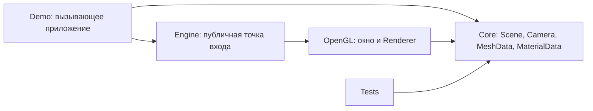
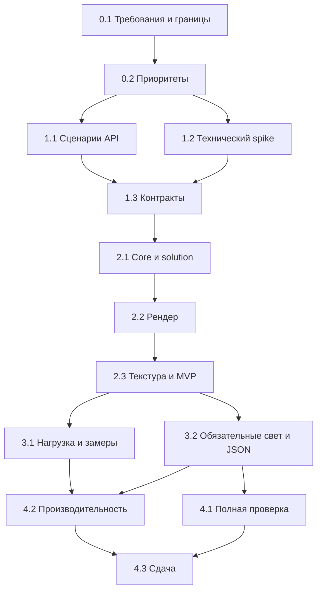

# План разработки учебного 3D-графического движка на C#

**Статус:** рабочий план, актуализирован на 07.10.2026. Solution net10.0 и CI созданы; базовый контракт v1 описан с сохранением расширений PR #26. Реализованы CPU-модели Core (#7); рендер и остальные функции движка еще не реализованы.

**Краткое резюме:** создаем на C# небольшой 3D-графический движок с публичным API, сценой, камерой, полигональными примитивами, базовой текстурой, простым освещением, сохранением/загрузкой сцены и отдельной демонстрацией. Для полной выбранной версии проверяем сцену около 1000 простых объектов и документируем FPS на конкретном ноутбуке. Архитектура — `Core` + `OpenGL` + `Demo` + `Tests`; игровой логики, физики и редактора нет.

Spike #5 выполнен, расширения света/JSON приняты в PR #26. Каркас и базовый контракт v1 подготовлены в #6; далее — CPU-данные #7 и renderer #9.

## 1. Ожидаемый результат

Нужно разработать **3D-графический движок** с простыми 3D-примитивами, полигонами, текстурами, сценой из множества моделей и внешним API. Это библиотека с демонстрацией возможностей, а не игра и не редактор.

На защите нужно показать выбранный набор функций, объяснить архитектуру, продемонстрировать внешний API и подтвердить работу проверками: сценариями, тестами и замером FPS.

## 2. Требования верхнего уровня

| ID | Требование |
|---|---|
| L-01 | Командный 3D-графический движок на C# с отдельным публичным API. |
| L-02 | Базовая работа с простыми 3D-примитивами, полигонами и текстурами. |
| L-03 | Зафиксировать требования, приоритеты, реализуемость, архитектуру и внешний API. |
| L-04 | Реализовать выбранную и приоритизированную основную функциональность без попытки охватить все возможные функции. |
| L-05 | Подготовить многообъектную сцену около 1000 простых объектов и воспроизводимый замер FPS на выбранном ноутбуке. |
| L-06 | Ограничить движок отображением сцены, моделей, камеры и геометрических преобразований; не включать игровую логику, физику и коллизии в базовый объем. |
| L-07 | Подготовить smoke-сценарии, автоматические проверки там, где они применимы, и регрессионную проверку после изменений. |
| L-08 | Проверять устойчивость запуска/закрытия, отсутствие явных утечек и узкие места производительности. |
| L-09 | Организовать командную работу: роли, зоны ответственности, задачи, PR, review и вклад участников. |
| L-10 | Учитывать лицензии сторонних библиотек, моделей, текстур и других ассетов. |

L-05 не задает строгую гарантию для любого железа. Команда фиксирует конкретный стенд, параметры сцены и реальные результаты измерения.

### 2.1. Инженерные требования для работоспособного результата

- Сцене нужны координаты, положение и ориентация объектов, камера, преобразование из 3D в изображение и правильное перекрытие ближних/дальних полигонов. Иначе L-01/L-02 невыполнимы.
- Нужны ясные контракты для вершин/индексов/UV, текстур и владения графическими ресурсами. Иначе невозможно независимо писать сцену, загрузку и рендерер.
- Нужна небольшая вызывающая программа (`Demo`), демонстрирующая публичный API. Иначе невозможно убедиться, что получилась библиотека движка, а не одноразовая программа.
- Нужны фиксированный стенд и нагрузочная сцена для честной проверки приблизительного ориентира L-05. Разрешение и длительность измерения назначает команда.
- Нужны инструкции сборки/запуска и список ограничений, чтобы демонстрацию можно было воспроизвести.
- При выборе OpenGL нужны минимальные шейдеры и управление GPU-ресурсами как часть реализации рендера. Это техническая необходимость выбранного пути, а не отдельное требование к «системе пользовательских шейдеров».

### 2.2. Открытые вопросы

| Вопрос | Статус и безопасное временное решение |
|---|---|
| Достаточно ли процедурных примитивов или нужен импорт модели? | Ответ получен 05.10.2026: импорт сторонних моделей не требуется; используем куб и плоскость. Простая сериализация/десериализация собственной сцены обязательна (P0-11), согласован JSON. |
| Какой формат текстуры выбрать? | Для MVP использовать один распространенный растровый формат и собственную контрольную текстуру. |
| Нужны ли свет, анимация и culling? | По ответу преподавателя 05.10.2026 простой свет обязателен (P0-10); отдельная анимация и frustum culling дополнительные. Согласован фоновый свет + один направленный источник с рассеянной составляющей, без теней/PBR. |
| Какая ОС является целевой? | Linux, подтверждено Team Lead. WSL на другом ПК — дополнительная проверка, не замена целевого стенда. |
| Какой ноутбук, разрешение и параметры FPS-замера использовать? | Выбран ПК VladimirKhmelev: i5-12450H, 16 ГБ RAM, встроенная Intel UHD. Полные характеристики и протокол — в [`docs/requirements.md`](docs/requirements.md), раздел 8; фактические версии ОС, драйвера и OpenGL-контекста из spike 1.2 — в [`docs/spikes.md`](docs/spikes.md#стенд). Разрешение фиксируется при подготовке нагрузки; 30–60 FPS — ориентир Team Lead, точного порога преподаватель не задал. |
| Как распределить участников и ревьюеров? | Зафиксировано в [`docs/team.md`](docs/team.md) и GitHub issues; владельцы сверяются по полю `Assignee`, reviewer-кандидаты — по описаниям issues. |
| Каков формат сдачи? | Подтверждена демонстрация проекта на ПК; обязательность отдельного отчета/PDF/презентации не заявлена. |
| Каков срок сдачи? | По сообщению Team Lead — до декабря 2026 года, точный день не указан. 10 ноября — внутренняя плановая дата команды; срок отдельной сдачи первой части не уточнен. |

## 3. Что должно быть разработано и предъявлено

### По заданию

1. Для первой части — список требований с приоритетами, описание архитектуры и набросок внешнего API, проверенный сценариями. Рабочий объем уже зафиксирован; команда может корректировать его с записью причины.
2. Для второй части — работающий 3D-графический движок на C# с выбранными базовыми возможностями: примитивы/полигоны, текстуры, сцена с несколькими моделями, камера, рендер.
3. Несколько проверок возможностей движка и тесты; демонстрация живой работы и проверки производительности на выбранном ноутбуке.
4. Организация работы команды с зафиксированным вкладом, правилами внесения изменений и учетом лицензий ассетов.

### Рекомендуемые рабочие артефакты

| Артефакт | Почему нужен | Статус |
|---|---|---|
| `project_plan.md` | Единая карта работ и чек-лист | Создается сейчас. |
| `docs/requirements.md`, `docs/architecture.md`, `docs/api.md`, `docs/implementation_outline.md` | Позволяют отдельно обсуждать первое задание, фиксировать решения и раздать конкретные задачи | Подготовлены [требования](docs/requirements.md), [архитектура](docs/architecture.md), [проект API](docs/api.md) и [псевдокод разработки](docs/implementation_outline.md); технические гипотезы помечены для будущей проверки. |
| `README.md` | Сборка, запуск, управление демо, ограничения | К моменту MVP. |
| `docs/team.md`, `docs/development-process.md` | Состав, доступность, назначения, PR/review и правила решений | [Состав, роли, доступность и назначения](docs/team.md) зафиксированы; документационный и build/test CI настроены для каркаса solution. |
| `THIRD_PARTY.md` | Источники и лицензии внешних библиотек/ассетов | До добавления первого стороннего ассета. |
| Диаграмма компонентов и 2–3 сценария API | Проверить, что архитектура действительно обслуживает требования | В составе `architecture.md` и `api.md`; формальный UML необязателен. |
| Тесты и demo-сцены | Проверка геометрии, интеграции и поведения на экране | Наращивать вместе с функциями. |
| Отчет, презентация, отдельный PDF | Дополнительные материалы к защите | Делать только после уточнения формата сдачи или при явной пользе. |

## 4. Технологический стек и границы выбора

**Выбранный рабочий стек:** C#, .NET 10 SDK (`global.json`: 10.0.112 с rollForward latestFeature внутри .NET 10), целевой framework `net10.0`, OpenGL через OpenTK, `System.Numerics` для данных сцены и математики, тестовый проект MSTest на `dotnet test`. Переход на .NET 10 подтвержден Team Lead 30.09.2026; перед сборкой и проверкой на стенде требуется установленный .NET 10 SDK. [Поддержка версий .NET](https://learn.microsoft.com/en-us/dotnet/core/releases-and-support).

OpenTK предоставляет C# API к OpenGL и окно/ввод. Перед закреплением зависимости выполнить короткий technical spike: окно → треугольник → вращающийся куб → текстура → закрытие без ошибок на целевом ноутбуке.

`System.Numerics` дает `Vector3`, `Quaternion`, `Matrix4x4`, но у матриц есть конкретная конвенция умножения. Нужно проверить порядок матриц и передачу в OpenGL тестовой геометрией, прежде чем раздать работу нескольким людям. [Документация Matrix4x4](https://learn.microsoft.com/en-us/dotnet/api/system.numerics.matrix4x4). Выбор библиотеки изображений сделать после spike и проверки лицензий; импорт модели не обязателен, для сохранения собственной сцены согласован JSON; до этого не включать лишние пакеты.

**Пока не планируются:** Vulkan, второй graphics backend, движок физики, редактор, сетевой слой, база данных, микросервисы, собственная математика ради самой математики, PBR и сложная система материалов.

## 5. Предварительная архитектура C#

### 5.1. Модули и ответственность

| Модуль | Ответственность | Не отвечает за |
|---|---|---|
| `Engine3D.Core` | `Scene`, `SceneObject`, `Transform`, `Camera`, `MeshData` (вершины/индексы/UV), `MaterialData` (цвет + опциональная текстура), генерация базовых примитивов, проверки данных | Окно, ввод, вызовы OpenGL, игровые правила |
| `Engine3D.OpenGL` | Окно/контекст, GPU-буферы, простые шейдеры, depth test, загрузка текстуры, рендер кадра, освобождение ресурсов, публичная точка входа `Engine` | Физика, коллизии, хранение логики сцены |
| `Engine3D.Demo` | Создание сцены через публичный API, управление камерой/объектом для показа, smoke- и нагрузочный режимы | Внутренние OpenGL-вызовы |
| `Engine3D.Tests` | Проверки геометрии/матриц/валидности мешей и интеграции доступных без окна компонентов | Замена визуальной приемки и замера GPU-производительности |

`Core` не зависит от `OpenGL`; `OpenGL` зависит от `Core`; `Demo` зависит от публичных частей обоих; `Tests` проверяет `Core` и, где полезно, интеграцию. База данных и CLI не нужны: демо — оконная программа, параметры запуска вроде `--stress` возможны позднее без отдельного CLI-проекта.



### 5.2. Модель данных и алгоритмы

- `MeshData`: массив вершин с позицией, UV и нормалью, индексные треугольники. Представление и преобразование нормалей для P0-10 определены в [API](docs/api.md); контракт принят через PR #26.
- `SceneObject`: ссылка на mesh и материал плюс `Transform`; повторное использование одного mesh многими объектами важно для ~1000 инстансов.
- `Transform`: позиция, вращение, масштаб; `Camera`: видовая и проекционная матрицы. Для первой версии без parent/child.
- `MaterialData`: базовый цвет и опциональная текстура. Несколько слотов текстур, PBR-параметры и несколько источников света отложены за MVP.
- Внутренний GPU-кэш связывает данные mesh/texture с буферами/объектами OpenGL. **Выбранное правило:** GPU-ресурсами владеет `Engine` и освобождает их при завершении; `Scene`, `MeshData` и `TextureData` содержат только управляемые данные и не требуют отдельного `Dispose`. Раннее удаление ресурсов проработать после MVP, если измерения покажут потребность.
- Рендер кадра: очистка цвета/глубины → параметры камеры → обход видимых объектов → матрица модели → привязка mesh/материала/текстуры → рисование индексированных треугольников → обмен буферов. Frustum culling вводить только при показанном узком месте.

### 5.3. Публичный API: базовый контракт версии 1

Пользователь должен суметь создать `Engine`, `Scene` и `Camera`, добавить примитив с материалом/текстурой, изменить `Transform`, нарисовать кадры и корректно закрыть окно. Внутренние GPU handle, шейдерные программы и буферы не должны становиться частью обычного API. Подробные проектные контракты записаны в [API](docs/api.md), а порядок действий по модулям — в [псевдокоде](docs/implementation_outline.md).

Выбранный путь: `Engine.Create(options)` → `PrimitiveFactory.CreateCube()` → `scene.Add(object)` → `Engine.Run(scene, camera, onUpdate)` → `Dispose`. `Run` владеет циклом событий, а callback приложения меняет данные сцены. Отдельного `Initialize` и второго публичного цикла для P0 нет. Осуществимость жизненного цикла проверена spike #5; базовые сигнатуры и правила описаны в #6.

### 5.4. Отложенные элементы

Для P0 берем `Engine`, `Scene`, `SceneObject`, `Transform`, `Camera`, повторно используемые `Mesh`/`Texture`, разделение ядра и рендера, а также исключение игровой логики.

Чтобы не раздувать первый рабочий объем, за MVP откладываются:

1. Импорт OBJ, иерархия объектов, несколько texture slots, logger, `TryLoad*` и отдельная иерархия исключений. Освещение P0-10 и сохранение/загрузка P0-11 можно выполнить после первого MVP, но они обязательны к сдаче.
2. Второй публичный lifecycle вроде `Initialize()` вместе с `Create()`; в P0 оставлен один путь `Create` → `Run` → `Dispose`.
3. Ручное раннее освобождение отдельных GPU-ресурсов; в P0 владелец GPU-ресурсов — `Engine`.
4. Обязательная поддержка нескольких ОС; целевой стенд — Linux-ноутбук команды ([`docs/spikes.md`](docs/spikes.md#стенд)), переносимость на Windows и macOS оценивается отдельно.
5. Фиксированная физическая единица измерения; для графического движка достаточно системы осей, единицы условные.

### 5.5. Псевдокод минимального сквозного сценария

```text
создать Engine и окно
создать один MeshData куба и один MeshData плоскости
загрузить собственную контрольную текстуру
создать Scene с двумя SceneObject, их MaterialData и Transform
задать Camera
запустить Engine.Run(scene, camera, onUpdate)
  в onUpdate изменять угол куба или положение камеры
  внутри рендера получать GPU mesh/texture из кэша по CPU-объекту
  очистить цвет и глубину, передать матрицы, показать объекты
при закрытии освободить Engine и все принадлежащие ему GPU-ресурсы
```

Для нагрузки добавить около 1000 объектов, ссылающихся на **один** mesh, и записать `RenderedFrames`, длительность, число треугольников, разрешение, VSync и характеристики ноутбука. Полная раскладка действий и проверок дана в [псевдокоде разработки](docs/implementation_outline.md). Никакой игровой физики или сценариев поведения в движке для этого пути не требуется.

## 6. Ориентировочная структура solution

```text
Engine3D.sln
src/
  Engine3D.Core/
    Scene/       # Scene, SceneObject, Transform, Camera
    Geometry/    # MeshData, Vertex, PrimitiveFactory
    Materials/   # MaterialData
  Engine3D.OpenGL/
    Engine.cs     # публичная точка входа
    Rendering/    # Renderer, shaders, buffers
    Resources/    # загрузка и владение GPU-ресурсами
  Engine3D.Demo/
    Program.cs
    Assets/       # только ассеты с подтвержденными лицензиями
tests/
  Engine3D.Tests/
docs/
  requirements.md
  architecture.md
  api.md
  implementation_outline.md
  team.md
  development-process.md
README.md
THIRD_PARTY.md
project_plan.md
```

Физические проекты добавлять по мере начала этапов. Наличие папки в схеме не требует сейчас создавать пустые каталоги. Если нагрузка окажется маленькой, `Core` и `OpenGL` остаются двумя библиотеками; дополнительные слои не нужны.

## 7. Детальная декомпозиция и план реализации

Каждая карточка дает работу, ожидаемый результат, зависимости, риск и критерий готовности. Номера используются далее в зависимостях и приоритетах.

**Рабочий чек-лист этапов:**

- [x] 0.1. Зафиксировать рабочие требования и границы проекта.
- [x] 0.2. Зафиксировать P0/P1/P2 и критерии приемки в [рабочих требованиях](docs/requirements.md).
- [x] 0.3. Зафиксировать состав команды, правила репозитория и подготовить CI.
- [x] 1.1. Проверить архитектуру по сценариям внешнего API; результаты записаны в [архитектуре](docs/architecture.md) и [API](docs/api.md).
- [x] 1.2. Проверить OpenTK, матрицы, depth и текстуру коротким прототипом; результаты на целевом ноутбуке записаны в [отчете spike](docs/spikes.md).
- [x] 1.3. Согласовать базовый контракт v1 из #6 перед параллельной разработкой (PR #29).
- [ ] 2.1. Собрать solution и модель сцены: solution (#6) и CPU-модели с тестами (#7) готовы, фабрика куба/плоскости — #8.
- [ ] 2.2. Провести первый кадр через публичный API.
- [ ] 2.3. Добавить текстуру и завершить MVP-сцену.
- [ ] 3.1. Измерить сцену с множеством объектов.
- [ ] 3.2. Реализовать обязательные P0-10/11 после первого MVP; дополнительные функции только по отдельному выбору.
- [ ] 4.1. Провести автоматические и визуальные проверки.
- [ ] 4.2. Проверить производительность и устранить измеренные проблемы.
- [ ] 4.3. Подготовить воспроизводимую демонстрацию и документы.

### Этап 0. Подготовка проекта

#### 0.1. Зафиксировать рабочие требования и границы проекта — выполнено

- **Что сделать:** описать рабочие требования, границы P0/P1/P2 и открытые вопросы.
- **Цель:** дать команде понятный объем без лишних функций и спорных обещаний.
- **Результат:** таблица L-01…L-10, список открытых вопросов и рабочий P0 в [требованиях](docs/requirements.md).
- **Зависимости:** нет.
- **Возможные проблемы:** разрастание P0 и смешение MVP с будущими функциями.
- **Как проверить:** ранний срез проходит сценарии A/B; обязательные расширения C/D отделены от необязательных функций, их контракты приняты через PR #26; реализация проверяется отдельно.

#### 0.2. Зафиксировать границы и приоритеты — выполнено для рабочего плана

- **Что сделать:** выбрать P0/P1/P2 и список исключений; пройтись по каждому пункту с оценкой трудоемкости.
- **Цель:** уложить проект в краткий учебный срок.
- **Результат:** [таблица P0-01…P0-11, P1/P2, два базовых сценария и расширения C/D с критериями](docs/requirements.md) зафиксированы как рабочая база проекта.
- **Зависимости:** 0.1.
- **Возможные проблемы:** желание включить слишком много эффектов.
- **Как проверить:** базовые сценарии A/B покрывают ранний срез; C/D задают критерии P0-10/11. У каждого P0 есть результат и способ проверки; API-контракты расширений приняты через PR #26; базовые детали версии 1 остаются в #6.

#### 0.3. Организовать команду и репозиторий — выполнено

- **Что сделать:** зафиксировать состав/доступность, назначения направлений и правила веток/PR/review; расширить CI после появления solution.
- **Цель:** дать возможность параллельной работе без конфликтов и невидимого вклада.
- **Результат:** состав, роли, доступность, владельцы задач и reviewer-кандидаты зафиксированы в [team.md](docs/team.md); процесс PR/CI описан в [development-process.md](docs/development-process.md); репозиторий и документационный CI подготовлены. Build/test CI настроен для Engine3D.sln.
- **Зависимости:** базовое 0.2 для распределения работы; репозиторий можно готовить параллельно 0.1.
- **Возможные проблемы:** отсутствующие участники, перегруженный ревьюер, длинная очередь PR.
- **Как проверить:** у текущих задач указаны владельцы и два reviewer-кандидата, кроме собственных задач Team Lead; после появления кода тестовый PR проходит согласованный процесс.

### Этап 1. Архитектура и проверка технического пути

#### 1.1. Пройти сценарии внешнего API — выполнено на уровне проектирования

- **Что сделать:** записать 2–3 сценария: текстурированный куб; множество объектов с камерой; штатное закрытие/повторный запуск. Нарисовать зависимости модулей и черновые C# сигнатуры только для P0.
- **Цель:** убедиться, что движком действительно сможет пользоваться внешняя программа.
- **Результат:** [описание архитектуры](docs/architecture.md) и [проект публичного API](docs/api.md) с ограниченным контрактом и двумя сценариями.
- **Зависимости:** 0.2.
- **Возможные проблемы:** лишние публичные сущности, несогласованное владение ресурсами.
- **Как проверить:** оба сценария проходят через перечисленные публичные действия без прямого доступа вызывающей программы к OpenGL; каждому действию соответствует тип/операция. Критерий выполнен на бумаге; проверка работоспособности остается в spike и MVP.

#### 1.2. Spike окна, матриц и текстуры

- **Что сделать:** отдельный выбрасываемый прототип на OpenTK/.NET: окно, треугольник, куб, depth test, PNG-текстура, корректное закрытие. Зафиксировать версию OpenGL, систему осей, порядок матриц, ограничения стенда.
- **Цель:** снять самые опасные технологические неизвестности до полной архитектуры.
- **Результат:** короткая заметка с результатом и минимальный прототип или решение сменить graphics API binding.
- **Зависимости:** 0.2; можно вести параллельно 1.1.
- **Возможные проблемы:** контекст не создается на ноутбуке, перевернута текстура, неправильно умножены матрицы.
- **Как проверить:** куб с разными сторонами и текстурой вращается, ближняя грань перекрывает дальнюю, окно закрывается без исключения.

#### 1.3. Заморозить контракты перед параллельной работой

- **Что сделать:** решить формат `Vertex/MeshData`, типы математики, координаты/UV, жизненный цикл окна, владение mesh/texture, ошибки загрузки, минимальный API.
- **Цель:** не заставить команды переписывать интеграцию.
- **Результат:** версия 1 проектных контрактов в `docs/api.md` и небольшие задачи по модулям.
- **Зависимости:** 1.1, 1.2.
- **Возможные проблемы:** преждевременное обещание будущих функций.
- **Как проверить:** разработчик рендера и разработчик сцены независимо понимают одинаковые типы и последовательность вызовов; пробный код клиента составляется без «заглушек на будущее».

### Этап 2. Минимальная рабочая версия

#### 2.1. Собрать solution и модель сцены

- **Что сделать:** создать проекты `Core/OpenGL/Demo/Tests`, `Scene`, `SceneObject`, `Transform`, `Camera`, `MeshData`, фабрику куба/плоскости и простые проверки данных.
- **Цель:** получить компилируемую основу с разделением данных и рендера.
- **Результат:** чистая сборка; тесты матриц и mesh.
- **Зависимости:** 1.3.
- **Возможные проблемы:** несогласованные координаты, вырожденные треугольники.
- **Как проверить:** `dotnet build` и `dotnet test` успешны; числовые проверки преобразований проходят.

#### 2.2. Реализовать минимальный рендер и публичный путь

- **Что сделать:** контекст, буферы, базовые шейдеры, depth test, камера, обход сцены, освобождение GPU-ресурсов; обеспечить один понятный способ запустить и остановить рендер.
- **Цель:** доказать сквозной путь от C# API до кадра на экране.
- **Результат:** демо с несколькими непрозрачными цветными примитивами.
- **Зависимости:** 2.1, результат spike 1.2.
- **Возможные проблемы:** несовпадение матриц CPU/GPU, поток владения контекстом, порядок Dispose.
- **Как проверить:** два объекта на разных глубинах отображаются верно, камера перемещается, штатное закрытие не дает падения.

#### 2.3. Нанести одну текстуру и оформить smoke-сцену

- **Что сделать:** добавить UV и один формат изображения, загрузку/применение текстуры, фиксированную демонстрационную сцену и краткую инструкцию запуска.
- **Цель:** закрыть базовую работу с текстурами в демонстрационном сценарии.
- **Результат:** MVP-демо с текстурированным вращающимся кубом и вторым объектом.
- **Зависимости:** 2.2.
- **Возможные проблемы:** ориентация UV, ошибки файла, неподтвержденная лицензия текстуры.
- **Как проверить:** текстура совпадает с контрольным рисунком, отсутствующий файл дает понятную ошибку, повторный запуск успешен.

### Этап 3. Основная реализация после MVP

#### 3.1. Подготовить сцену с множеством объектов и замеры

- **Что сделать:** повторно использовать mesh/texture для множества `SceneObject`; задать фиксированный профиль нагрузки, счетчик времени кадра/FPS и записать параметры стенда.
- **Цель:** проверить многообъектную сцену и найти узкое место на реальном железе.
- **Результат:** воспроизводимая stress-сцена и протокол результатов.
- **Зависимости:** 2.3.
- **Возможные проблемы:** синхронизация по VSync скрывает реальные значения, частые выделения памяти, лишние draw calls.
- **Как проверить:** одинаковый сценарий запуска дает сопоставимые замеры; результаты содержат число объектов, разрешение, настройки, модель GPU/CPU, длительность.

#### 3.2. Реализовать обязательные освещение и сохранение сцены; затем оценить дополнительные функции

- **Что сделать:** реализовать P0-10 (фоновый + направленный рассеянный свет) и P0-11 (JSON собственной сцены) по согласованным контрактам; проверить сценарии C/D из требований. Отдельные анимация/culling и импорт — только при отдельном выборе команды; сохранение/загрузка сцены заведены в #25 (VladimirKhmelev); новые назначения для дополнительных функций согласовывать отдельно.
- **Цель:** выполнить обязательный объем по ответу преподавателя 05.10.2026, сохранив простой первый MVP.
- **Результат:** освещенная сцена и сохранение/восстановление примитивов, transform, материалов/путей текстур, камеры и света; отдельные сценарии и проверки.
- **Зависимости:** принятые в PR #26 контракты света/нормалей и JSON, затем 2.3; финальный замер 3.1 повторить с обязательным освещением. Выбор дополнительных P1 — по замерам и оставшемуся времени.
- **Возможные проблемы:** свет меняет формат вершины/шейдер; JSON требует правил восстановления ресурсов и путей; дополнительный culling может не ускорить простую сцену.
- **Как проверить:** каждое расширение имеет конкретную демо-проверку и не ломает MVP-сцену.

### Этап 4. Интеграция, тестирование и подготовка сдачи

#### 4.1. Проверить корректность и надежность

- **Что сделать:** добавить смысловые unit-тесты матриц/индексов/загрузчика, интеграционные проверки создания сцены и ресурсов, регрессионный запуск старых тестов, ручной визуальный чек-лист, повторные циклы запуска/закрытия.
- **Цель:** не полагаться на единственный успешный показ.
- **Результат:** зеленый CI и заполненный протокол smoke-проверок.
- **Зависимости:** 2.3, а для тестов P1 — 3.2.
- **Возможные проблемы:** GPU-тесты нестабильны на CI без дисплея; unit-тесты не видят визуальных дефектов.
- **Как проверить:** автоматические проверки проходят, визуальные сценарии воспроизводятся на целевом ноутбуке, известные ограничения записаны.

#### 4.2. Проверить производительность и устранить подтвержденные проблемы

- **Что сделать:** повторить 3.1 на согласованной машине; профилировать при отклонении, исправлять измеренное узкое место, проверить длительную работу и освобождение памяти.
- **Цель:** подтвердить производительность выбранного сценария и устойчивость работы.
- **Результат:** протокол до/после для существенных оптимизаций или честное ограничение при недостижении цели.
- **Зависимости:** 3.1, 4.1.
- **Возможные проблемы:** аппаратные различия, драйвер, слишком сложная нагрузочная сцена.
- **Как проверить:** выбранный сценарий соответствует согласованному критерию FPS, нет длительного ухудшения/роста памяти; отклонения объяснены.

#### 4.3. Подготовить передачу и демонстрацию

- **Что сделать:** обновить README, архитектуру/API, реестр лицензий, список вклада; провести показ «с чистого клона»: сборка, тесты, демо, нагрузочный режим, закрытие.
- **Цель:** сделать результат воспроизводимым и защищаемым.
- **Результат:** репозиторий и краткий сценарий защиты.
- **Зависимости:** 4.1, 4.2.
- **Возможные проблемы:** локальные абсолютные пути, недостающие ассеты/пакеты, недокументированные горячие клавиши.
- **Как проверить:** участник, не писавший демо, запускает проект по README на целевом компьютере без устных подсказок.

## 8. MVP

**Самая маленькая рабочая система:** внешний код создает `Scene` с двумя примитивами, назначает цвет/одну текстуру, задает `Camera`, запускает окно, видит корректную глубину, может изменить положение объекта или камеры и завершить программу без сбоя.

**В MVP входит:** C# solution; простая mesh-модель с UV и нормалями по принятому публичному контракту; куб/плоскость; сцена/объект/transform/камера; OpenGL-рендер с минимальными шейдерами и depth test; одна текстура; публичный путь запуска; демо; несколько тестов математики и smoke-чек-лист.

**Ранний MVP не требует:** реализации освещения P0-10 и сохранения/загрузки сцены P0-11; они обязательны для полной версии после первого среза. Нормали уже входят в согласованный формат `Vertex`, даже если первый шейдер их не использует. OBJ/FBX/glTF-импорт, иерархия объектов, отдельная анимация, culling, прозрачность, отражения, физика, коллизии, редактор, PBR и сетевые функции не входят в обязательный объем.

**После MVP:** масштабирование сцены и первый замер FPS; затем обязательные освещение P0-10 и сохранение/загрузка P0-11 из 3.2, проверки C/D и финальный FPS-замер с освещением. Дополнительные P1 выбирать отдельно по оставшемуся времени и замерам. Пустые заглушки под несделанные функции не выдавать за поддержку.

## 9. Приоритеты

Приоритет означает обязательность для выбранного полного объема, а не порядок календарного выполнения: нагрузку измеряем после MVP, но она остается P0 для готовой версии. Подробные критерии см. в [требованиях](docs/requirements.md).

| ID | Выбранный P0 для полной версии | Приемочное свидетельство |
|---|---|---|
| P0-01 | Публичная C#-библиотека и отдельное демо | Демо не вызывает OpenGL напрямую. |
| P0-02 | Сцена с несколькими объектами и общим mesh | Один mesh используется многими объектами без копирования данных на каждый объект. |
| P0-03 | Индексные треугольники, куб и плоскость | Примитивы видны, неверные индексы отклоняются. |
| P0-04 | Transform и камера | Положение/поворот и ракурс меняются в ходе показа. |
| P0-05 | Рендер с корректной глубиной | Ближняя непрозрачная грань перекрывает дальнюю. |
| P0-06 | Базовый материал и текстура по UV | Контрольная PNG отображается в правильной ориентации. |
| P0-07 | Сцена около 1000 простых объектов и замер | Есть воспроизводимый протокол FPS на указанном ноутбуке с параметрами сцены. |
| P0-08 | Корректное завершение и проверки | Повторные запуски, unit/integration/smoke и регрессия проходят. |
| P0-09 | Документы первого задания | Требования, архитектура и API проходят сценарии, включая обязательные расширения C/D; контракты расширений приняты через PR #26, реализация проверяется отдельно. |
| P0-10 | Простое освещение | Фоновый + один направленный рассеянный свет; изменение направления меняет яркость граней при корректной текстуре и глубине. |
| P0-11 | JSON собственной сцены | Сохранение и загрузка в новую сцену восстанавливают примитивы, transform, материалы/пути текстур, камеру и свет; неверный файл дает понятную ошибку. |

| Приоритет | Задачи/функции | Причина |
|---|---|---|
| Critical / P0 | P0-01…P0-11: проектирование, базовый рендер, текстура, проверка нагрузки, тесты, устойчивость, документы, простое освещение и сериализация; задачи 0.1–0.3, 1.1–1.3, 2.1–2.3, 3.1–3.2 (обязательная часть), 4.1–4.3 | Нужно для выбранной командой полной версии и демонстрации. |
| High / P1 | Необязательный импорт одного простого формата модели, frustum culling при измеренной пользе, простая анимация по ключевым кадрам | Кандидаты после стабильного P0; выбор функций — по условиям из docs/requirements.md, замерам и оставшемуся времени. Замеры могут обосновать выбор culling командой, но он остается дополнительной функцией по требованиям преподавателя. |
| Medium / P2 | Иерархия объектов, несколько источников света, сложные материалы, продвинутая анимация, улучшение диагностики | Реализовать только после оценки оставшегося времени и интеграционного риска; не входит в выбранный P0. |
| Low / P3 | Дополнительные эффекты, универсальные плагины | Высокая стоимость для учебного срока; не входит в выбранный P0. |

Depth test для выбранного OpenGL-пути остается внутренней необходимостью базового рендера; импорт OBJ и публичные будущие типы не должны задерживать MVP.

## 10. Зависимости и параллельная работа



**Параллельно:** организацию репозитория (0.3) — с уточнением требований; spike (1.2) — со сценариями API (1.1); после 1.3 — фабрику mesh, рендер и демо по согласованным контрактам, но сборку сквозного сценария делать часто. Тест-кейсы для P0 и README можно вести вместе с 2.1–2.3. Подготовку stress-сцены можно начинать сразу после 2.2; первый замер после 2.3, финальный — с обязательными функциями 3.2.

## 11. Распределение работы команды

Состав, роли, доступность и владельцы задач зафиксированы в [team.md](docs/team.md); пары reviewer-кандидатов хранятся в соответствующих GitHub issues. Алексей Зарубин как Team Lead принимает PR и решение о merge. PR остальных участников требует двух `Approve` от разных людей, не являющихся автором. Собственные PR Team Lead не требуют чужих ревью; он может выполнить merge самостоятельно после успешных проверок. Подробный процесс — в [development-process.md](docs/development-process.md).

## 12. Стратегия тестирования и приемки

| Уровень | Что проверить | Когда |
|---|---|---|
| Числовые/unit | Порядок матриц, преобразование точки, камера, индексы треугольников, UV, обработка неверных данных | С 1.2/2.1 |
| Интеграция | Путь `Scene → Renderer`, загрузка/использование текстуры, корректное завершение и повторный запуск | С 2.2 |
| Smoke/визуально | Две геометрии, вращение/камера, перекрытие по глубине, контрольная текстура, отсутствие артефактов | Каждое демо и перед сдачей |
| Регрессия | Старые тесты и сцены после каждого значимого изменения | В CI и перед merge |
| Производительность | Фиксированная сцена с приближением к ~1000 простых объектов; FPS/frame time и параметры стенда | 3.1/4.2 |
| Длительная работа | Несколько запусков/закрытий, отсутствие постоянного роста памяти и сбоев | 4.1/4.2 |

CI должен минимум собирать solution и запускать тесты, которые не требуют графического контекста. Визуальная проверка GPU остается на доступном ноутбуке; не объявлять ее пройденной только по зеленому CI. Для FPS фиксировать разрешение, VSync, число объектов/треугольников, длительность прогрева и замера, средний FPS и характер длительных просадок. Реальные данные сохраняются независимо от результата.

## 13. Критический анализ и риски

| Риск | Вероятность | Последствия | Снижение риска |
|---|---|---|---|
| Неясная граница P0/P1 | Средняя | Можно ошибиться с объемом функций или форматом сдачи | Держать выбранный P0 в `docs/requirements.md`; спорные функции начинать только после согласования. |
| OpenGL/драйвер/контекст на целевой машине | Средняя | Срыв демо при готовом `Core` | Spike 1.2 именно на целевом ноутбуке, зафиксировать версии и запасной компьютер. |
| Несовпадение конвенций `System.Numerics` и шейдеров | Высокая без проверки | Неверная камера, перевернутые или исчезающие объекты | Малый числовой тест + цветной контрольный куб до параллельной разработки. |
| Текстуры и лицензии ассетов | Средняя | Неправильная картинка или недопустимые файлы в репозитории | Контрольная собственная текстура; реестр источников; не использовать игровые ассеты без разрешения. |
| Ошибка в реализации выбранного владения GPU-ресурсами | Средняя | Утечки, двойное освобождение, падения при закрытии | Владелец — `Engine`; проверить жизненный цикл и повторный запуск. |
| Разрастание P0 | Средняя | Не завершится базовый рендер | Изменение P0-10/11 обосновано ответом преподавателя; ограничить свет и JSON согласованным минимумом, OBJ/иерархию оставить дополнительными. |
| Работа 1000 объектов ниже целевого FPS | Средняя | Слабая демонстрация производительности | Повторное использование mesh, ранний stress-сценарий, профилирование перед оптимизацией. |
| Слишком много проектов/интерфейсов и «заделов» | Средняя | Время уйдет на абстракции и согласование | Четыре проекта максимум на старте; интерфейс только на реальной границе/для тестирования. |
| Параллельная работа без контракта | Высокая для большой команды | Конфликты PR и повторная реализация | 1.3 до раздачи модулей, маленькие PR и частая интеграция. |
| GPU-тесты зависят от среды CI | Высокая | Ложно красный CI или отсутствие визуальной проверки | Unit/integration без окна в CI; отдельная воспроизводимая ручная GPU-проверка. |
| Нехватка времени/неравная загрузка | Средняя | Критическая задача остается у недоступного участника | Таблица доступности и резервный владелец для критического пути. |

Интерфейсы оправданы на границе публичного API и при сменяемом загрузчике/рендерере, если это действительно понадобится. Для одного OpenGL backend не вводить `IRenderer`, `ITextureManager`, фабрики и плагинную систему только ради абстракции. Расширяемость P1 обеспечивать прежде всего ясными структурами данных и небольшим API, а не пустыми публичными методами. Оптимизацию делать после измерений 3.1.

## 14. Контрольные точки

Ориентировочный ритм от начала командной работы: сначала документы, организационная основа и technical spike; затем Core, первый кадр и текстура; затем нагрузка, проверки и подготовка показа. Если фактический срок короче, сначала защищать P0 и сокращать P1.

| Milestone | Проверяемый критерий |
|---|---|
| M1 — План готов к обсуждению | Требования имеют приоритеты, спорные пункты вынесены отдельно; архитектура и API проходят минимум два сценария; команда знает владельцев задач. |
| M2 — Технический путь подтвержден | На целевом компьютере окно OpenTK показывает 3D-куб с depth и текстурой, фиксированы конвенции матриц и способ закрытия. |
| M3 — MVP работает | Чистая сборка и тесты успешны; демо по публичному API показывает несколько объектов, камеру и текстуру, корректно завершается. |
| M4 — Основная реализация проверена | Выполнены обязательные P0-10/11 и согласованные P1, если выбраны; stress-сцена измерена; старые тесты и smoke-сценарии проходят. |
| M5 — Готово к сдаче | Проект запускается по README с чистого клона, лицензии учтены, вклад команды виден, сценарий защиты выполнен на целевом ноутбуке. |

## 15. Definition of Done

**Текущий этап — готовность плана:**

- [x] Зафиксированы рабочие требования, границы проекта и открытые вопросы.
- [x] Явные требования, инженерные выводы и неопределенности разделены.
- [x] Зафиксированы требования P0-01…P0-11, первый MVP и дополнительные функции.
- [x] Согласованы API и архитектурные контракты обязательных расширений C/D (свет/нормали и JSON сцены), приняты через PR #26. Это не завершение всей #6.
- [x] Описаны C# архитектура, публичный путь API, псевдокод модулей и зависимости задач.
- [x] Определены проверки, риски, роли, процесс PR/CI, milestones и критерии полной готовности проекта.

Каркас solution, build/test CI и CPU-модели Core с тестами (#7) созданы; рендер и остальные функции движка, графические проверки и нагрузочные замеры еще не выполнены. Ниже — критерии **будущего завершения самого проекта**.

Проект можно считать полностью выполненным, если одновременно:

- [ ] Реализованный объем соответствует зафиксированным P0-01…P0-11; любые изменения объема записаны с причиной.
- [ ] Первое задание содержит список функций, оценку реализуемости, содержательную архитектуру и пригодный внешний API; 2–3 сценария через него проходят.
- [ ] На C# собраны библиотека движка и отдельная демонстрационная программа; внешнему коду не нужны прямые OpenGL-вызовы для типового сценария.
- [ ] Реализованы все **выбранные P0**: сцена, простые 3D-полигоны/примитивы, камера, преобразования, базовое текстурирование, корректный рендер и закрытие, простое освещение и сохранение/загрузка сцены.
- [ ] Выбранный объем основной реализации подтвержден демонстрацией; невыполненные P1/P2 перечислены без выдачи заглушек за функции.
- [ ] Есть unit/integration/regression и smoke-проверки, а результаты CI и ручной визуальной проверки зафиксированы.
- [ ] Нагрузочная сцена и параметры целевого ноутбука задокументированы; результат замера честно указан.
- [ ] Учет сторонних ассетов/лицензий, README, схема модулей/API, правила PR/review и индивидуальный вклад доступны в репозитории.
- [ ] Любой участник команды может объяснить границы графического движка и показать работу по сценарию защиты.

Целевая версия .NET 10 и framework net10.0 подтверждены. Сдача — демонстрация проекта на ПК VladimirKhmelev под Linux; срок преподавателя со слов Team Lead — до декабря 2026 года, 10 ноября остается внутренней плановой датой. Характеристики стенда и уточнения по #3 записаны в docs/requirements.md, раздел 8. Формальный порог FPS преподаватель не задал; 30–60 FPS — рабочий ориентир Team Lead. Разрешение замера и срок отдельной сдачи первой части не уточнены. Ответ получен 05.10.2026: свет и простая сериализация обязательны; отдельная анимация/culling дополнительные, импорт сторонних моделей не требуется. Решения команды — JSON сцены и фоновый + направленный рассеянный свет. Контракты расширений приняты через [PR #26](https://github.com/alken1t15/simple-3d-engine/pull/26); это не заявление об их реализации или завершении базовой версии 1 API в #6.

## 16. Следующий конкретный шаг

**После согласования базового контракта начать #7:** solution net10.0, CI и базовый контракт v1 подготовлены. Расширения света/JSON приняты в PR #26 и сохранены. Далее реализовать CPU-данные #7, примитивы #8, renderer #9, текстуры #10, JSON #25, Demo A–D #11 и проверки.

